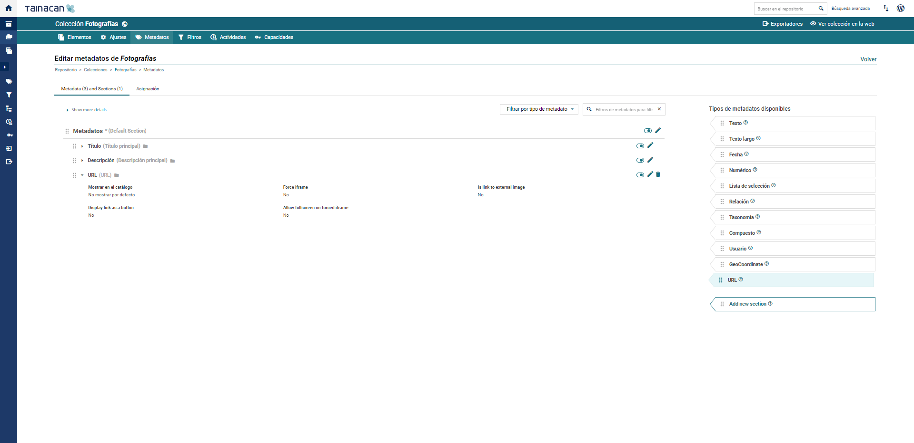
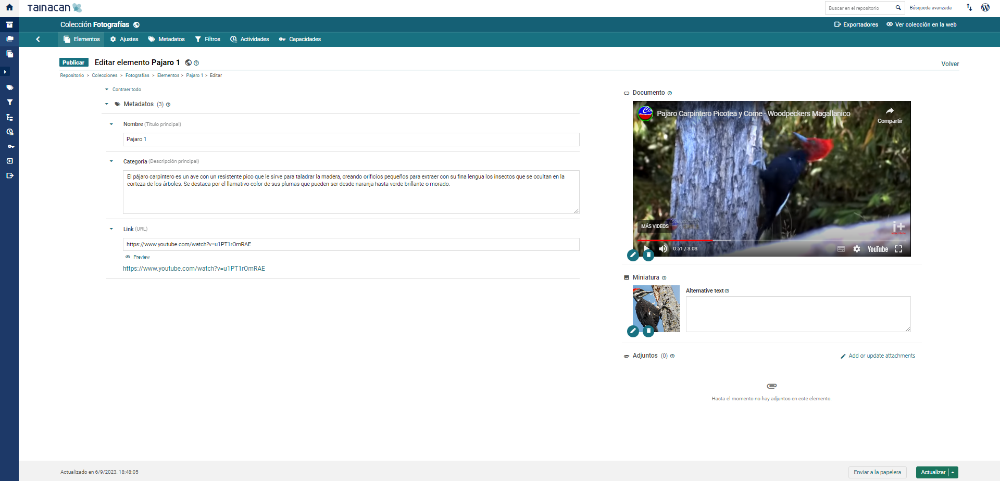
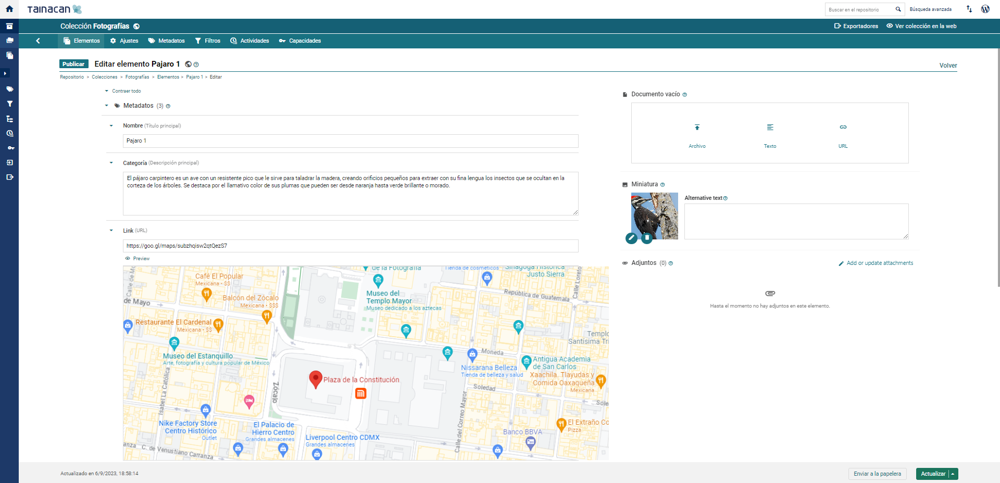
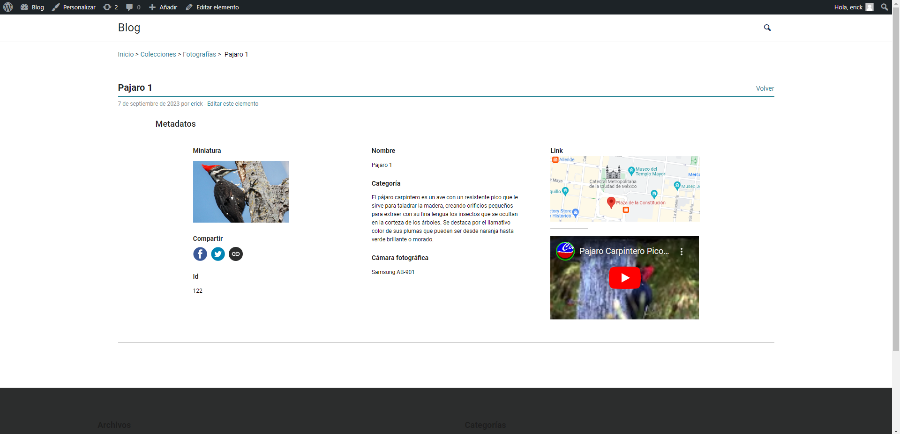

# Plugin: Tipo de metadatos URL

Este plugin amplía la funcionalidad del plugin Tainacan añadiendo soporte para un tipo de metadatos extra, útil para mostrar enlaces URL como contenido incrustado, ya sea a través de la función de auto-incrustación de _WordPress_ o forzando el uso de un iframe. Es una solución para aquellos interesados en tener más de un tipo de URL de documento o que esperan que los archivos adjuntos también acepten URLs.

## Instalación

En tu página de plugins _WordPress_, busca "Tainacan" y activa el plugin "Tainacan Extra Visualisation Modes". También lo encontrarás [en este enlace](https://es.wordpress.org/plugins/tainacan-metadata-type-url/). A partir de ahí, basta con instalarlo pulsando un botón.

Si lo prefiere, también puede descargar el archivo [.zip](https://github.com/tainacan/tainacan-metadata-type-url/releases) del [repositorio GitHub](https://github.com/tainacan/tainacan-metadata-type-url) y siga las instrucciones de instalación descritas en [nuestra sección sobre la instalación de plugins](/es-mx/plugins#instalación-de-plugins).

Ative o plugin na sessão de plugins do painel administrativo do _WordPress_.

## Configuración

Vaya a la página de Metadatos de su colección o repositorio. En la sección "Tipos de metadatos disponibles" debería aparecer el tipo URL. Selecciónelo y cree un nuevo metadato, dándole el nombre que prefiera. Por defecto, este plugin intenta mostrar una vista previa del contenido del enlace utilizando la estrategia de auto-incrustación de _WordPress_. Hay [una lista limitada](https://wordpress.org/support/article/embeds/#okay-so-what-sites-can-i-embed-from ":ignore") de enlaces que funcionan con esta estrategia, como los enlaces de YouTube, Twitter, Spotify, etc. Si tus enlaces no aparecen ahí (por ejemplo, un enlace de Google Maps) y sigues queriendo mostrar la vista previa del contenido en la lista de metadatos del artículo, puedes activar la opción "Forzar el uso de iframe" y otros ajustes relacionados.

?> Aunque utilices la opción "Forzar el uso de iframe", es posible que la URL que estés utilizando no permita incrustar contenido mediante iframe. Se trata de una configuración habilitada por los autores del sitio que no puede ignorarse.

Con los metadatos configurados y listos, cree un nuevo elemento e inserte los valores de la URL en él. Puedes previsualizarlo con un botón mientras estás en el formulario de edición del elemento, o ir a la página del elemento para ver la previsualización.

