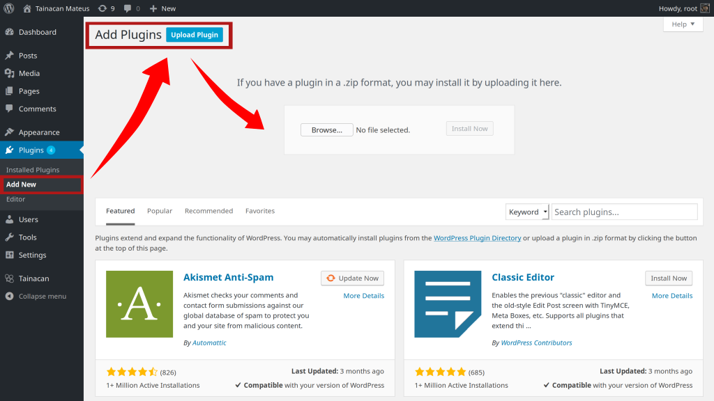

# Plugins

?> _TODO_ Esta página está en _portugués brasileño_ solo hasta ahora. **Si puede, ayúdenos a traducirlo al _español_.**

O Tainacan é um _plugin_ para o _WordPress_, o que significa que ele incrementa as funcionalidades do _WordPress_ com novos recursos. Isto faz parte da filosofia do _WordPress_ de prover uma solução núcleo importante que possa atender a maioria dos usuários e ainda assim oferecer a possibilidade de se escolher extenções para torná-lo mais adequado a diferentes requisitos. O mesmo se aplica ao Tainacan em si, que tenta trazer as principais funcionalidades da gestão e exibição de acervos digitais por padrão, deixando algumas funcionalidades extra como _plugins para o plugin_.

## Plugins Disponíveis

- [Expositor PDF](/es-mx/plugin-pdf-exposer) (Beta) - Adiciona o expositor PDF, que permite visualizar listas de itens no formato PDF.
- [Metadado Tipo URL](/es-mx/plugin-metadata-type-url) - Adiciona um tipo de metadado que aceita URLs e exibe uma versão incorporada ou em iframe do seu conteúdo.
- [Modos de Visualização Extra](/es-mx/plugin-extra-view-modes) - Adiciona vários modos de visualização alternativos para a lista de itens.
- [WordPress 3DHOP](/es-mx/plugin-3d-hop) (Beta) - Adiciona suporte a documentos com modelos 3D utilizando o [3D HOP](http://3dhop.net/);

## Instalando os plugins

Os plugins listados acima que não estão mais em fase beta já podem ser instalados diretamente pelo painel administrativo do _WordPress_. Basta pesquisar por "Tainacan" na página de plugins do painel administrativo do seu site. Já os que estão em beta previsam de ter sua instalação feita manualmente. Veja como a seguir

### Instalando um plugin pelo Painel

Uma maneira visual de instalar os plugins que foram baixados é ir ao painel administrativo do _WordPress_, acessar a sessão de Plugins e clicar em "Adicionar novo". Isto te levará para a lista de plugins e no topo você verá o botão "Enviar plugin" onde você poderá selecionar seu arquivo `.zip`.



### Instaling um plugin via WP-CLI

Se você faz uso da [CLI do WordPress](https://wp-cli.org/#installing), as coisas ficam mais fáceis, Tudo que você precisa fazer é rodar, na seu diretório do _WordPress_:

```
wp plugin install /CAMINHO/PARA/SEU/ARQUIVO/ZIP/nome-do-plugin.zip
```

### Instalando um plugin diretamente do Servidor

O mesmo processo pode ser feito manualmente com acesso aos arquivos do seu servidor. Para isso, extraia seu arquivo `zip` e o mova para a pasta `wp-content/plugins`, em uma pasta com o mesmo nome do plugin.

## Ativando o plugin

Não se esqueça que uma vez instalado o plugin, **você ainda precisa ativá-lo** na lista de plugins do painel administrativo do _WordPress_.
