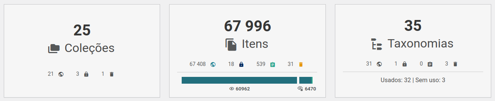
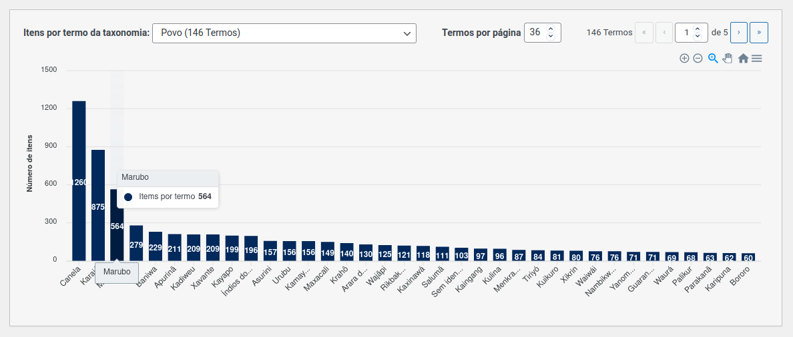
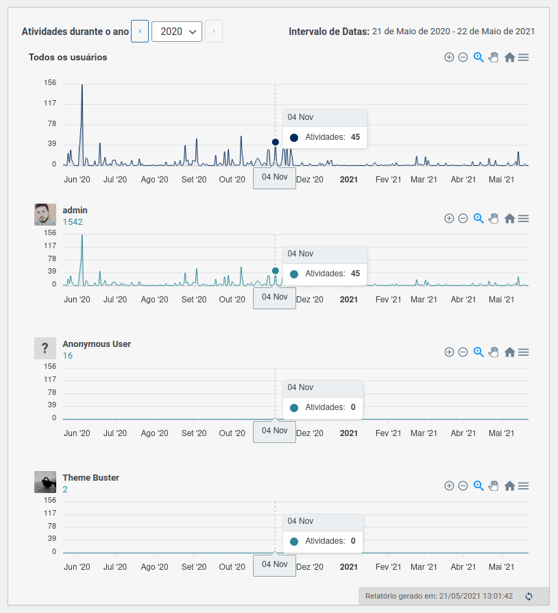
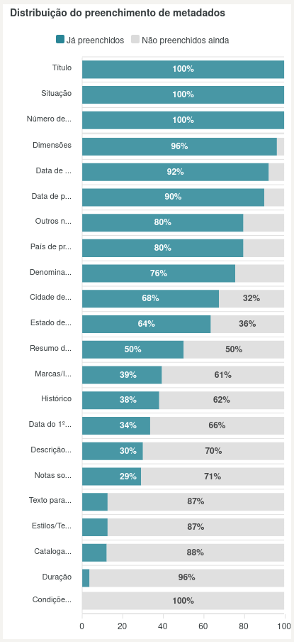
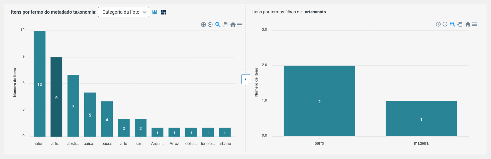

# Relatórios

?> _TODO_ Esta página está en _portugués brasileño_ solo hasta ahora. **Si puede, ayúdenos a traducirlo al _español_.**

Apresentada na _versão 0.18_, a **página de relatórios** ou **painel de relatórios**, é o módulo do Tainacan responsável por apresentar estatísticas e dados do repositório através de gráficos. Esta ferramenta coloca na mão do gestor do acervo visualizações ricas para se compreender melhor a distribuição dos dados, tanto no sentido de conhecer melhor as informações exibidas ao público, quanto no sentido de auxiliar o trabalho de gerenciamento para compreender onde é necessário maior esforço para tratamento e amadurecimento da qualidade destes dados.

Nesta página explicitamos cada elemento presente neste painel.

## Tela dos Relatórios

A tela dos relatórios do Tainacan é o espaço onde se pode ter acesso ao painel de visualizações geradas pela API dos relatórios. Está acessível no submenu do plugin Tainacan, sob o rótulo de "Relatórios".

Logo que se acessa o painel, são carregadas as estatísticas gerais do Repositório, e uma caixa de seleção permite que se escolha entre a visão dos relatórios do Repositório como um todo, ou de alguma das coleções existentes no acervo.

Logo abaixo desta caixa de seleção, pode ser vista uma barra de legenda, que auxilia na compreensão da iconografia utilizada por alguns blocos do painel:

Como já apontado por esta barra de legenda, a maioria dos gráficos possui um recurso de _exportação_, que permite a visualização do gráfico externamente no formato de imagem, vetor, ou planilha de dados CSV, o que facilita a incorporação dos gráficos em relatórios feitos fora da plataforma Tainacan.

## Re-gerando relatórios

Para garantir uma boa performance sem pesar o servidor, os relatórios são gerados e guardam as informações por uma semana.

?> Isto significa que se visitada esta página num certo dia, os dados apresentados nos próximos 7 dias serão os mesmos, mesmo que alterações tenham sido feitas no repositório.

Para ver a data de quando o relatório foi gerado, basta passar o mouse por cima de cada bloco, que a informação estará no canto inferior esquerdo, como na imagem ao lado.

Caso seja desejada uma atualização forçada com os dados mais recentes, é preciso clicar no botão de recarregar que aparece ao lado desta data.

## Blocos de Sumarização

O painel tem início com os chamados blocos de sumarização, que ao invés de gráficos trazem os números totais do acervo. No nível repositório, são listados totais de Coleções, Itens e Taxonomias, estratificados por seu status. No nível coleção, o total de Itens e Metadados daquela Coleção.

Uma observação a ser feita é que no nível repositório, além dos status, os itens também apresentam as informações de _**Visibilidade** (Acesso aberto / Acesso restrito)_. Esta informação combina o status da Coleção com o do Item, já que itens de _status público_ não estarão disponíveis ao público caso a Coleção esteja _privada_.

## Total de Itens por Coleção

O primeiro gráfico apresentado no relatório é um gráfico de barras empilhadas verticais. No eixo Y, mostra o total de itens, e no eixo X, cada coleção do repositório. Com sua ordenação por maior quantidade de itens, da esquerda para a direita, fica fácil visualizar quais coleções tem maior quantitativo de itens no acervo. No canto lateral direito do gráfico, a legenda que aponta qual o status dos itens nas frações coloridas das barras, também serve como um filtro, já que clicando em uma das barras, os dados deste status somem e vê-se apenas os restantes.

## Uso de Termos por Taxonomia

O gráfico seguinte também é um gráfico de barras empilhadas verticais. No eixo Y, mostra o total de termos, e no eixo X, cada taxonomia do repositório. É apresentado não só o total de termos em cada taxonomia, mas também quais destes termos estão sendo utilizados em pelo menos algum item do repositório, através da legenda que filtra as seções empilhadas de "Termos em uso" e "Termos sem uso". Isto já fornece de antemão uma noção de quais taxonomias possuem um vocabulário mais relevante para o acervo, do ponto de vista quantitativo.

## Total de Itens por Termo de Taxonomia

O terceiro gráfico exibido na tela de repositório é um gráfico de barras vertical onde o eixo X novamente apresenta o total de itens, porém no eixo Y estão agora termos de uma taxonomia. É uma visão do quanto cada termo de cada taxonomia é usado, porém, apenas uma é escolhida por vez, através da caixa de seleção existente acima do gráfico.

!> Por ter o potencial de listar uma quantidade de dados considerável (algumas taxonomias em repositórios possuem mais de 300 termos), **este é um gráfico paginado**. Isto quer dizer que por vez, são exibidos um padrão de **56 termos no máximo**. Este foi o valor escolhido para permitir uma leitura mínima dos dados no eixo horizontal e não pesar demais a memória do navegador que precisa processar estas informações para montar a visualização. Como a requisição feita para a API vem ordenada, pode-se ter garantia de que, os termos mostrados na primeira página, terão mais itens que nas seguintes. Ainda assim, além de navegar pelas páginas é possível alterar a quantidade de itens por página, porém sujeito ao risco de se travar o navegador!

Este gráfico fornece uma importante visão de como os itens estão distribuídos no uso de termos em uma taxonomia. Uma importante observação é que aqui são listados **os termos sem discriminação hierárquica**, ou seja, termos pais e seus termos filhos estão no mesmo nível, caso existam. Mais a seguir apresentaremos [um gráfico](#total-de-itens-por-metadado-tipo-taxonomia-na-coleção) que lida com estas informações.

## Total de Atividades por Usuário

Ao final da tela dos relatórios, estão os gráficos relacionados à atividade e gestão do acervo. O primeiro é um gráfico de barras empilhadas horizontal, onde no eixo Y estão listados os usuários do sistema e no eixo X, o total de atividades feitas por este usuário. Este total pode ser filtrado através da legenda que agrupa diferentes tipos de atividade.

## Atividades Diárias por Ano e Usuários

Neste gráfico, também são visualizadas a quantidade de atividades por usuário, porém com as atividades distribuídas no eixo X, que contém os últimos 365 dias. O primeiro gráfico mostra a soma total de atividades de todos os usuários e abaixo do mesmo estão os gráficos dos demais usuários, ordenados por aqueles com maior total neste ano.

Com esta visualização, é possível observar facilmente os períodos de maior atividade no repositório, bem como quando e quão ativos foram os usuários na gestão do acervo.

## Tipos de Metadados da Coleção

No primeiro gráfico do painel de relatórios de uma coleção, está um gráfico de barras vertical que mostra o total de cada tipo de metadado utilizado na coleção. Este gráfico possui dois modos: pode ser visto como um gráfico circular caso seja preferido, clicando-se no ícone ao lado do título do gráfico.

## Distribuição de Preenchimento de Metadados na Coleção

Logo ao lado está um dos gráficos mais relevantes do painel de relatórios da coleção.

> Com este gráfico de barras horizontal, é possível visualizar facilmente quais os metadados da coleção que estão com valores preenchidos nos itens.

O eixo Y lista cada metadado existente enquanto o eixo X mostra em porcentagem o total de itens onde foi colocado algum valor. Este gráfico pode ser interpretado como um conjunto de barras de progresso, a partir das quais se sabe que informações precisam ser providenciadas ainda para garantir que a documentação do acervo esteja completa.

Por não ser possível ainda (devido a limitações da biblioteca de gráficos) implementar as opções de Zoom em gráficos de barras horizontais como este, este gráfico pode gerar um scroll vertical, caso a quantidade de metadados existentes gere muitas barras no eixo y. Por isso, foi tomada a decisão de uma altura mínima que as barras devem ter, para que seja possível a leitura dos rótulos com o espaço disponível em tela.

## Total de Itens por Metadado Tipo Taxonomia na Coleção

Por fim, no painel de relatórios da coleção, há um gráfico similar ao de ["Total de Itens por Termo de Taxonomia"](#total-de-itens-por-termo-de-taxonomia), presente no painel do repositório. Este gráfico mostra quantos itens possuem um determinado termo como valor de um metadado tipo taxonomia. Havendo mais de um metadado tipo taxonomia na coleção, é possível trocar na caixa de seleção ao lado do título do gráfico. Observa-se então no eixo Y, o total de itens e no eixo X, os termos desta taxonomia. Assim como no gráfico citado anteriormente, este gráfico oferece uma paginação para quantidades grandes de termos.

Há uma diferença importante do gráfico nível repositório porém, já que **neste é possível navegar na hierarquia destes termos**.

> Por padrão, são carregados apenas totais de itens por termos "raiz", ou seja, termos que não são filhos de nenhum outro termo. Se algum destes termos possuir filhos, ao se passar o mouse sobre ele, será informado que os possui, e pode-se então clicar na barra para carregar ao lado, um novo gráfico, com o total de itens por termos filhos deste. A mesma rotina pode ser feita clicando-se em termos filhos que possuam filhos. Neste caso, o gráfico com os filhos ocupará o espaço do gráfico com dos pais, e o gráfico com os termos netos ocupará seu espaço. Para se ver apenas o primeiro gráfico com um maior espaço (caso não haja, por exemplo, nenhum termo filho a ser carregado) pode-se clicar no botão com uma seta para a direita, localizada entre os dois painéis, que faz com que o gráfico ocupe toda a largura disponível.

Por fim, este bloco também oferece uma visualização em gráfico _alternativo_. **Ao invés do gráfico de barras, pode-se ver os dados em um mapa de árvore (_treemap_)**. Nesta visualização, a área do retângulo diz respeito ao total de itens com todos os termos carregados. Cada retângulo interno corresponde aos dados aninhados do total de item por aquele termo. Esta visualização fornece uma visão particular das facetas da coleção.

