# Informes

Presentado en la versión 0.18, la página de informes o panel de informes, es el módulo de Tainacan encargado de presentar estadísticas y datos del repositorio a través de gráficos. Esta herramienta pone a disposición del gestor del repositorio ricas visualizaciones para comprender mejor la distribución de los datos, tanto en el sentido de conocer mejor la información que se muestra al público, como en el de ayudar a la labor de gestión para comprender dónde es necesario un mayor esfuerzo de tratamiento y maduración de la calidad de estos datos.

En esta página explicamos cada elemento presente en este panel.

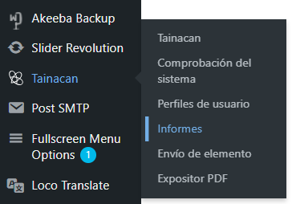

## Pantalla de informes

La pantalla de informes de Tainacan es el espacio donde se accede al panel de visualizaciones generadas por la API de informes. Es accesible en el submenú del plugin Tainacan, bajo la etiqueta "Informes".

Nada más acceder al panel, se cargan las estadísticas generales del Depósito, y un cuadro de selección permite elegir entre la visualización de los informes para el conjunto del Depósito, o para cualquiera de las colecciones de los fondos.

Justo debajo de este cuadro de selección puede verse una barra de subtítulos, la cual ayuda a comprender la iconografía utilizada por algunos de los bloques del panel:

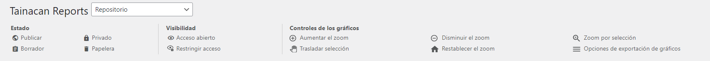

Como se observa en esta barra de subtítulos, la mayoría de los gráficos disponen de una función de exportación que permite visualizar el gráfico externamente en formato de imagen, vectorial o de hoja de cálculo CSV, lo que facilita la incorporación de los gráficos a informes realizados fuera de la plataforma Tainacan.

## Regeneración de informes

Para garantizar un buen rendimiento sin sobrecargar el servidor, se generan informes y la información se almacena durante una semana.

?> Esto significa que si visita esta página en un día determinado, los datos que se mostrarán durante los próximos 7 días serán los mismos, incluso si se han realizado cambios en el repositorio.

Para ver la fecha en que se generó el informe, basta con pasar el ratón por encima de cada bloque, y la información aparecerá en la esquina inferior izquierda, como en la imagen de al lado.

Si desea una actualización forzada con los datos más recientes, haga clic en el botón de recarga que aparece junto a esta fecha.

## Bloques de resumen

El panel comienza con los llamados bloques de resumen, que en lugar de gráficos muestran los números totales de la colección. A nivel de repositorio se enlistan los totales de Colecciones, Elementos y Taxonomías, estratificados por su estado. A nivel de colección, el total de elementos y metadatos de esa colección.

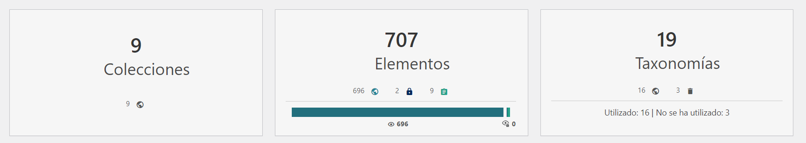

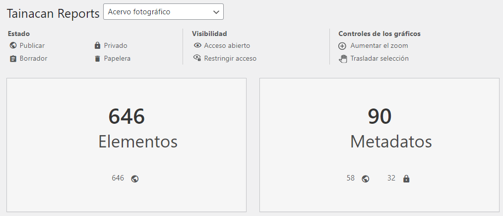

Una observación a realizar es que a nivel de repositorio, además de los estados, los elementos también presentan la información de _**Visibilidad** (Acceso Abierto / Acceso Restringido)_. Esta información combina el estatus de la Colección con el de Elementos, ya que los elementos con estatus público no estarán disponibles al público si la colección es _privada_.

## Total de elementos por colección

El primer gráfico que se muestra en el informe es un diagrama de barras verticales. En el eje Y, muestra el número total de artículos, y en el eje X, cada colección del repositorio. Con su disposición por mayor cantidad de ítems, de izquierda a derecha, es fácil ver qué colecciones tienen más elementos en la colección. En la esquina derecha del gráfico, la leyenda que indica el estado de los ítems en las fracciones coloreadas de las barras sirve también como filtro, ya que al pulsar sobre una de las barras, desaparecen los datos de ese estado y sólo se ven los elementos restantes.

## Uso de términos por taxonomía

El siguiente gráfico es también un diagrama de barras verticales. El eje Y muestra el número total de términos, y el eje X cada taxonomía del repositorio. No sólo se muestra el número total de términos de cada taxonomía, sino también cuáles de estos términos se están utilizando en al menos algún elemento del repositorio, a través de la leyenda que filtra las secciones apiladas de "Términos en uso" y "Términos no en uso". Esto proporciona, de antemano, una noción de qué taxonomías tienen un vocabulario más relevante para la colección, desde un punto de vista cuantitativo.

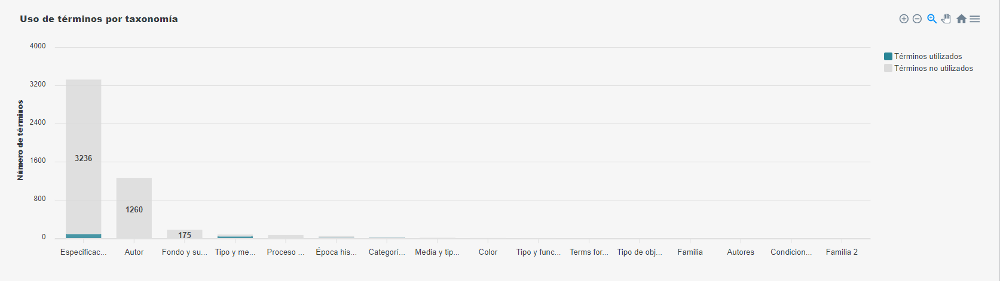

## Total de elementos por término de taxonomía

El tercer gráfico que se muestra en la pantalla del repositorio es un gráfico de barras verticales donde el eje X nuevamente muestra el total de elementos, mientras que el eje Y aparecen ahora términos de una taxonomía. Esta es una vista de cuánto se utiliza cada término de cada taxonomía, sin embargo, sólo uno se elige a la vez a través de la casilla de verificación por encima del gráfico.

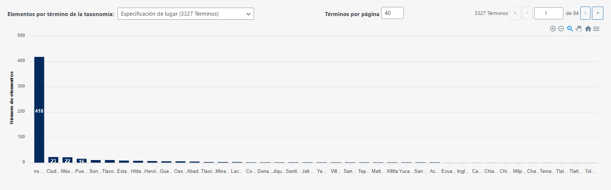

!> Dado que tiene el potencial de enumerar una cantidad considerable de datos (algunas taxonomías de repositorios tienen más de 300 términos), **se trata de un gráfico paginado**. Esto significa que se muestra un patrón máximo de **56 términos a la vez**. Este valor se eligió para permitir una lectura mínima de datos en el eje horizontal y no sobrecargar la memoria del navegador que necesita procesar esta información para configurar la visualización. Como la petición realizada a la API está ordenada, se puede garantizar que los términos mostrados en la primera página tendrán más elementos que en las siguientes. Aun así, además de navegar por las páginas, es posible modificar el número de elementos por página, ¡a riesgo de que el navegador se bloquee!

Este gráfico ofrece una visión importante de cómo se distribuyen los elementos en el uso de los términos en una taxonomía. Una observación importante es que aquí los **términos se enumeran sin discriminación jerárquica**, es decir, los términos padres y sus términos hijos, , si los hay, se encuentran en el mismo nivel. A continuación se presenta un [gráfico](#total-de-elementos-por-tipo-de-taxonomía-de-metadatos-en-la-colección) con esta información.

## Actividades totales por usuario

Al final de la pantalla de informes, se encuentran gráficos relacionados con la actividad y gestión de la colección. El primero es un gráfico de barras horizontales, donde los usuarios del sistema se enumeran en el eje Y y el total de actividades realizadas por este usuario en el eje X. Este total se puede filtrar a través de la leyenda que agrupa diferentes tipos de actividad.

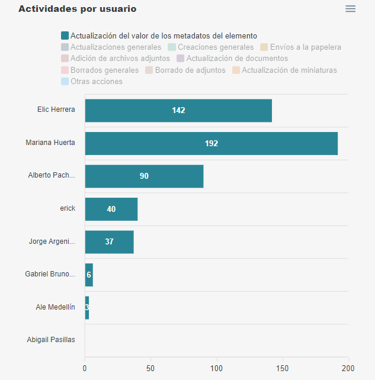

## Actividades diarias por año y usuarios

En este gráfico también se visualiza la cantidad de actividades por usuario, pero con las actividades distribuidas en el eje X, que contiene los últimos 365 días. El primer gráfico muestra la suma total de actividades de todos los usuarios, y debajo están los gráficos de los demás usuarios ordenados por los que tienen el total más alto en este año.

Con esta visualización, es posible observar fácilmente los períodos de mayor actividad en el repositorio, así como cuándo y qué tan activos estuvieron los usuarios en el manejo de la colección.

## Tipos de metadatos de colección

El primer gráfico que aparece en el panel de informes de una colección, de barras verticales, muestra el total de cada tipo de metadatos utilizados en la colección. Este gráfico también puede verse en formato circular, si se prefiere, haciendo clic en el icono situado junto al título del gráfico.

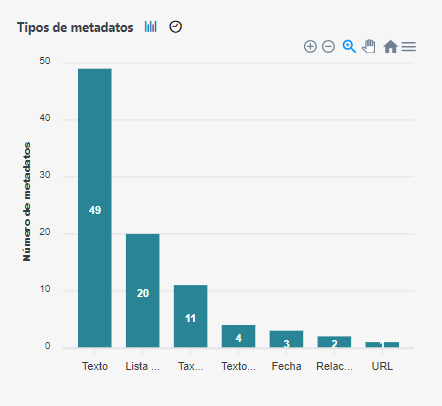

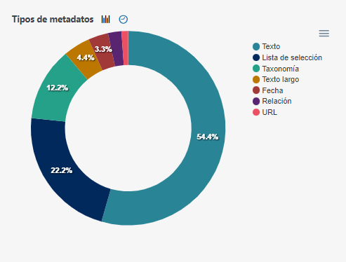

## Avances del llenado de metadatos en la colección

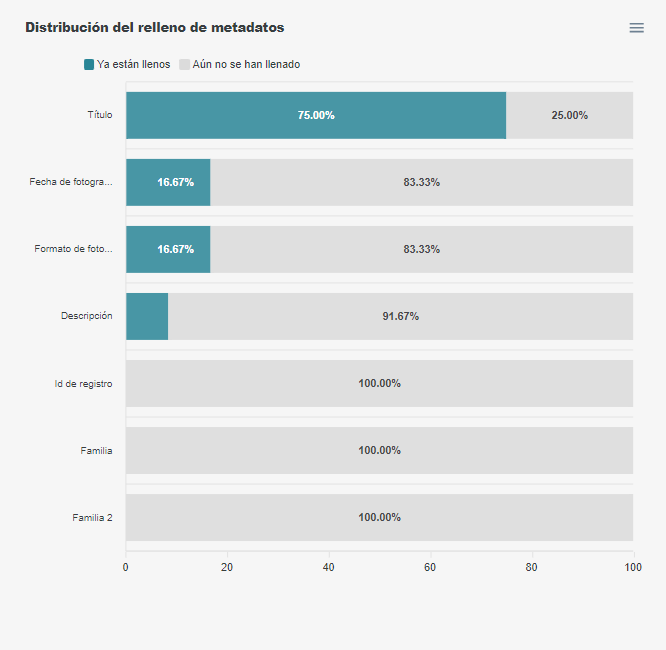

Aquí se encuentra uno de los gráficos más relevantes en el panel de informes de la colección.

> Con este gráfico de barras horizontales, puedes ver fácilmente qué metadatos de una colección tienen valores en los elementos.

El eje Y enumera cada metadato existente, mientras que el eje X muestra en porcentaje el número total de elementos donde se colocó algún valor. Este gráfico se puede interpretar como un conjunto de barras de progreso, a partir de las cuales se sabe qué información queda por aportar para que la documentación de la colección esté completa.

Como aún no es posible implementar opciones de Zoom en gráficos de barras horizontales de este tipo (debido a las limitaciones de la biblioteca de gráficos), este gráfico puede generar un desplazamiento vertical si la cantidad de metadatos existentes genera demasiadas barras en el eje Y. Por este motivo, se ha decidido una altura mínima que deben tener las barras, de forma que sea posible leer las etiquetas con el espacio de pantalla disponible.

## Total de elementos por tipo de taxonomía de metadatos en la colección

Por último, en el panel de informes de la colección, hay un gráfico similar al de ["Artículos totales por término de taxonomía"](#total-de-elementos-por-término-de-taxonomía), presente en el panel del repositorio. Este gráfico muestra cuántos elementos tienen un término determinado como valor de un metadato de tipo taxonomía. Si hay más de un metadato de tipo taxonomía en la colección, es posible cambiar en el cuadro de selección situado junto al título del gráfico. El eje Y muestra el número total de artículos y el eje X los términos de esta taxonomía. Como en el gráfico mencionado anteriormente, este gráfico ofrece una paginación para grandes cantidades de términos.

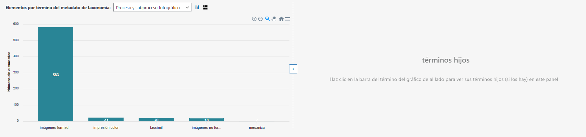

Sin embargo, hay una diferencia importante con el gráfico a nivel de repositorio, ya que **en éste es posible navegar por la jerarquía de estos términos**.

> Por defecto, sólo se cargan los elementos totales de los términos "raíz", es decir, los términos que no son hijos de ningún otro término. Si alguno de estos tiene hijos, al pasar el ratón por encima de él, se informará de que tiene hijos y se podrá cargar junto a él un nuevo gráfico con el total de ítems por término hijo. El mismo procedimiento se puede realizar pulsando sobre los términos hijos que, a su vez, tengan hijos. En este caso, el gráfico con los hijos ocupará el espacio del gráfico padre, y el gráfico con los términos nietos ocupará su espacio. Para ver sólo el primer gráfico con un espacio mayor (si no hay, por ejemplo, términos hijos que cargar), se puede hacer clic en el botón con una flecha hacia la derecha, situado entre los dos paneles, para que el gráfico ocupe todo el ancho disponible.

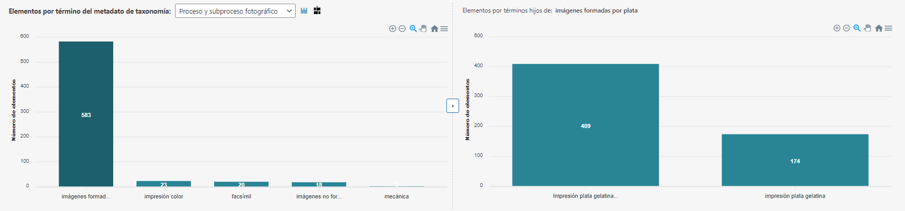

Finalmente, este bloque también ofrece una visualización gráfica _alternativa_. **En lugar del gráfico de barras puede ver los datos en un mapa de árbol (_treemap_)**. En esta vista, el área del rectángulo se refiere al número total de artículos con todos los términos cargados. Cada rectángulo interior corresponde a los datos anidados del total de artículos por ese término. Esta visualización proporciona una visión particular de las facetas de la colección.

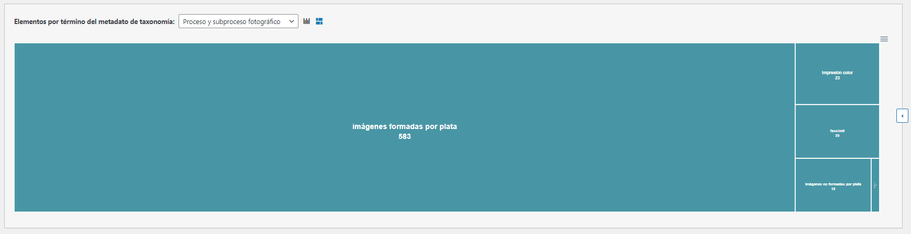
