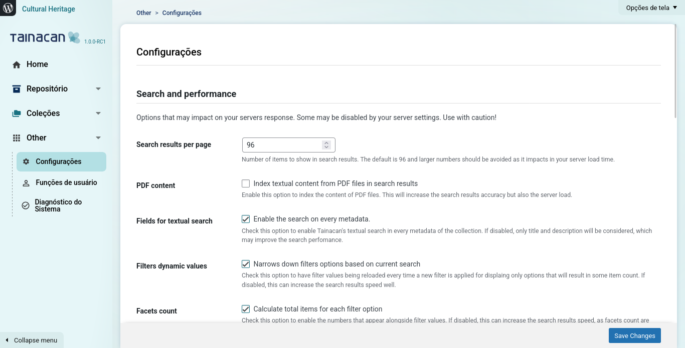

# Settings Page

?> _TODO_ Esta página está en Inglés. Si puedes, ¡ayúdanos a traducirla al Español!

The Plugin Settings Page was introduced in version `1.0.0` to offer users powerful configurations over the plugin's default behavior. You can access it via "Tainacan Admin" -> "Other" -> "Settings". Some of these options were already available previously via PHP constants that had to be defined in servers file such as `wp-config.php`. In this document will cover each of the available options by section. 

## 1. Search and Performance

This section contains options that may impact your server's response time and performance. Some options may be disabled by your server settings, so use with caution.

### Available Settings:

**Search results per page**
- **Description**: By default every paginated search in Tainacan has a maximum results number. While you'll see many listings in the UI displaying 12 items/collections/taxonomies per page, you can usually increase that value either via UI or via URL. However even via URL and API requests, this number will never be greater than the one defined in this settings. For example, in the Exposers modal (*View as...* button), links are split in pages based on this value.
- **Default**: 96 items
- **Impact**: Larger numbers should be avoided as they impact server load time
- **Note**: This setting can be overridden by the `TAINACAN_API_MAX_ITEMS_PER_PAGE` constant

**PDF content**
- **Description**: When enabled, Tainacan will try to index textual content from PDF files in search results. The indexing happens when the item is updated and it depends on certain server settings to work well. To know more about PDF indexing, check [this page](es-mx/indexing-pdf.md).
- **Default**: Disabled
- **Impact**: Increases search accuracy but also server load
- **Note**: This setting can be overridden by the `TAINACAN_INDEX_PDF_CONTENT` constant

**Fields for textual search**
- **Description**: Enable search on every metadata field. When using the textual search input that exists in items lists, we look into every textual metadata that the item may have. This extends on the default WordPress behavior and thus costs in terms of performance. Disabling will make textual searched look only into core title and description fields.
- **Default**: Enabled
- **Impact**: If disabled, only title and description will be considered, which may improve search performance
- **Note**: This setting can be overridden by the `TAINACAN_DISABLE_DEFAULT_SEARCH_ENGINE` constant

**Filters dynamic values**
- **Description**: Whenever a filter is applied in the faceted search you'll noticed that other filters are reloaded and their facets (options) are narrowed down. This behavior helps refining the search but can slow down the results. Disable it to keep all filter options available, even if selecting them may result in empty searches.
- **Default**: Enabled
- **Impact**: If disabled, this can increase search results speed significantly
- **Note**: This setting can be overridden by the `TAINACAN_FACETS_DISABLE_FILTER_ITEMS` constant

**Facets count**
- **Description**: Defines if filters in the faceted search should display a number aside each facet (value option). The value indicate how many items have that value but is also heavy to be calculated before a search is applied.
- **Default**: Enabled
- **Impact**: If disabled, this can increase search results speed, as facets count are heavy to process
- **Note**: This setting can be overridden by the `TAINACAN_FACETS_DISABLE_COUNT_ITEMS` constant

## 2. Theme Default Templates

This section contains options related to [theme compatibility](./theme.md). If your theme doesn't implement its own versions of [Tainacan templates](./tainacan-pages.md), you can enable some options that will override WordPress default templates. Keep in mind that the plugin does not know anything of the classes, container sizes and aesthetics of your theme, so it does some effort to be generic while still offering the features that are expected in this pages. Extra customization might require at least some knowledge of CSS.

### Available Settings:

**Item page**
- **Description**: Replace WordPress post-like template with basic item information
- **Default**: Enabled
- **Features**: Inserts basic item information including the item document within the media gallery, custom metadata, and attachments
- **Note**: This setting can be overridden by the `TAINACAN_DISABLE_ITEM_THE_CONTENT_FILTER` constant

**Collection items page**
- **Description**: Replace WordPress blog-like template with a faceted search
- **Default**: Disabled
- **Features**: Displays the faceted search in the collection items page, including filters and custom view modes
- **Note**: This setting can be overridden by the `TAINACAN_ENABLE_COLLECTION_THE_CONTENT_FILTER` constant

**Taxonomy term items page**
- **Description**: Replace WordPress blog-like template with a faceted search
- **Default**: Disabled
- **Features**: Displays the faceted search in the taxonomy term items page, including filters and custom view modes
- **Note**: This setting can be overridden by the `TAINACAN_ENABLE_TAXONOMY_TERM_THE_CONTENT_FILTER` constant

**Repository items page**
- **Description**: Replace WordPress blog-like template with a faceted search
- **Default**: Disabled
- **Features**: Displays the faceted search in the repository items page, including filters and custom view modes
- **Note**: This setting can be overridden by the `TAINACAN_ENABLE_REPOSITORY_THE_CONTENT_FILTER` constant

**Taxonomy terms page**
- **Description**: Replace WordPress post-like template with a basic terms list
- **Default**: Enabled
- **Features**: Displays taxonomy terms list with links to child terms and their items, plus basic sorting and search options
- **Note**: This setting can be overridden by the `TAINACAN_DISABLE_TAXONOMY_THE_CONTENT_FILTER` constant

## 3. Default Theme Items List Options

This section contains options that will be used as defaults for items lists in collection and repository pages. **These settings might be overridden on multiple levels by user preferences, collection settings or theme options.**

### Available Settings:

**View mode**
- **Description**: Default view mode for displaying items
- **Default**: Masonry
- **Note**: Only available if multiple view modes are enabled
- **Options**: Depends on registered view modes (excludes full-screen modes)

**Enabled view modes**
- **Description**: Which view modes are available for users to choose from
- **Default**: All registered view modes (plugins and themes may register their own)
- **Note**: Users can select multiple view modes to enable

**Order by**
- **Description**: Default sorting criteria for items
- **Default**: Creation date
- **Options**: 
  - Title
  - Creation date

**Order**
- **Description**: Default sorting direction for items
- **Default**: Descending
- **Options**:
  - Ascending
  - Descending

## 4. Item Submission Forms with reCAPTCHA

This section allows you to configure Google reCAPTCHA for increased security when using the [Item's Submission block](./blocks-item.md#formulário-de-submissão-de-itens). Previous to version `1.0.0` this section was accessible via a Submenu of the Tainacan Admin menu and it is now moved to this page.

### Available Settings:

**Google reCAPTCHA Site Key**
- **Description**: Your Google reCAPTCHA site key
- **Purpose**: Used for client-side reCAPTCHA validation
- **Note**: Required for reCAPTCHA functionality

**Google reCAPTCHA Secret Key**
- **Description**: Your Google reCAPTCHA secret key
- **Purpose**: Used for server-side reCAPTCHA validation
- **Note**: Required for reCAPTCHA functionality

