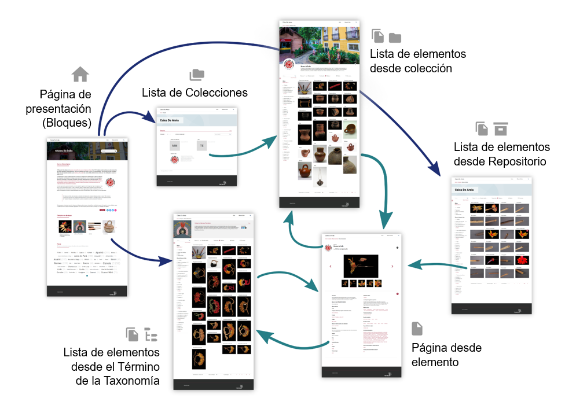

	

# Páginas de Tainacan

Con el plugin Tainacan activado en el WordPress, el propio plugin crea las siguientes páginas especiales:

- Página de colecciones `/colecciones`;
- Página de Todos los elementos del repositorio `/elementos`;
- Páginas de elementos de una colección slug nombre-de-la-colección `/nombre-de-la-colección`;
- Páginas de elementos con algunos metadatos de taxonomía de slug _nombre-de-taxonomía_ que tienen un término de slug _nombre-de-término_ `/nombre-de-taxonomía/nombre-de-término`;

A medida que vayas creando colecciones, elementos y términos podrás acceder, automáticamente a estas direcciones desde el sitio web. Por lo general, en el panel administrativo de Tainacan, encontrará los enlaces a estas páginas en botones con íconos de ojos (como el que se encuentra en la parte superior derecha de esta página). Además, también es posible crear tus propias páginas presentando las colecciones o explicando algo sobre tu repositorio. Son dos caminos diferentes, pero que están a tu disposición gracias a la **integración de Tainacan con WordPress**. Más información a continuación:

- [Páginas Especiales Generadas por Tainacan](#las-páginas-especiales-de-tainacan)
- [Creando tus propias páginas con bloques de Gutenberg](/es-mx/gutenberg-blocks)

## Las páginas especiales de Tainacan

### Página de colecciones

`/colecciones` o `/collections`, si su instalación está en inglés.

Disponible en su sitio desde el momento en que se crea una colección, esta página enumera sus colecciones con opciones para ordenar, buscar, paginar y ver en tablas o tarjetas. Es una buena manera de brindarle al público una vista sistemática de las colecciones que existen en su repositorio.

### Página de elementos del repositorio

`/elementos` o `/items`, si su instalación está en inglés.

Disponible en su sitio desde el momento en que se crea un elemento en cualquier colección, esta página enumera **todos los elementos de todas las colecciones en el repositorio**. Presentará algunas vistas predeterminadas, opciones de clasificación por metadatos de nivel de repositorio y una lista de todos los filtros para todas las colecciones, además de un filtro de colecciones. Si bien el acceso a todos  los elementos es potente, _recomendamos que se utilice con precaución_. Filtrar por un metadato específico dentro de una colección, por ejemplo, ocultará de la lista los elementos que no tengan ese metadato, lo que puede resultar confuso para quienes no estén familiarizados con la organización de su repositorio.

### Páginas de elementos de una colección

`/nombre-de-la-colección`

Esta es generalmente la página más importante de una instalación de Tainacan. En él se tiene acceso a la búsqueda por facetas de elementos dentro de una colección. Destacamos los recursos disponibles:

- Encabezado de la colección (cuya imagen, color y descripción son configurables en el formulario de edición de la colección);
- Filtros (los mismos que están disponibles en el panel administrativo, siempre que sean públicos);
- Búsqueda de texto simple y búsqueda avanzada;
- Ordenar de forma ascendente o descendente en todos los metadatos públicos;
- Modos de visualización, incluido el modo de pantalla completa (también están habilitados o deshabilitados en el formulario de edición de la colección);
- Modal de URLs relacionadas, proporcionando acceso a la misma lista en diferentes formatos como JSON, HTML, CSV, PDF (si el [plugin](/es-mx/plugin-pdf-exposer) está instalado) y con la posibilidad de realizar mapeos;

Toma en cuenta que la lista de elementos es la página de una colección en sí misma. Si haces clic en una colección en la lista de colecciones del sitio, irá a esa lista. Sin embargo, es posible que prefieras tener una [página de presentación personalizada](/es-mx/gutenberg-blocks), por ejemplo, para luego redirigir a tu lista de elementos. Esto también se puede modificar en el formulario de configuración de tu colección, en la opción "Página de presentación".

### Páginas de elementos de una condición

`/nombre-taxonomía/nombre-condición`

De manera similar a la lista de elementos de una colección, esta página muestra todos los elementos que tienen algunos metadatos de tipo taxonomía y que tienen un término específico en estos metadatos. La principal diferencia con la lista de colección es que el encabezado tendrá la imagen y descripción del término, configurable en su forma de edición.

Esta página es una excelente manera de llevar el concepto de "exposiciones" de colecciones múltiples a tu repositorio. Por ejemplo, si tienes una colección de pintura y otra de arquitectura con metadatos diferentes, pero en ambas existe un metadato de la Taxonomía **Movimiento Artístico**, puedes ver todos los ítems del término **Movimiento Renacentista** en un solo lugar, agrupando allí los ítems de ambas colecciones.
