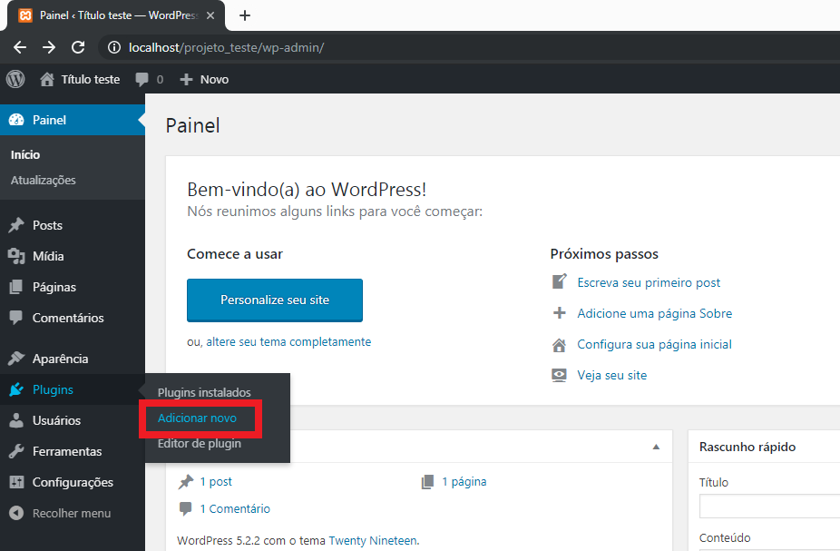
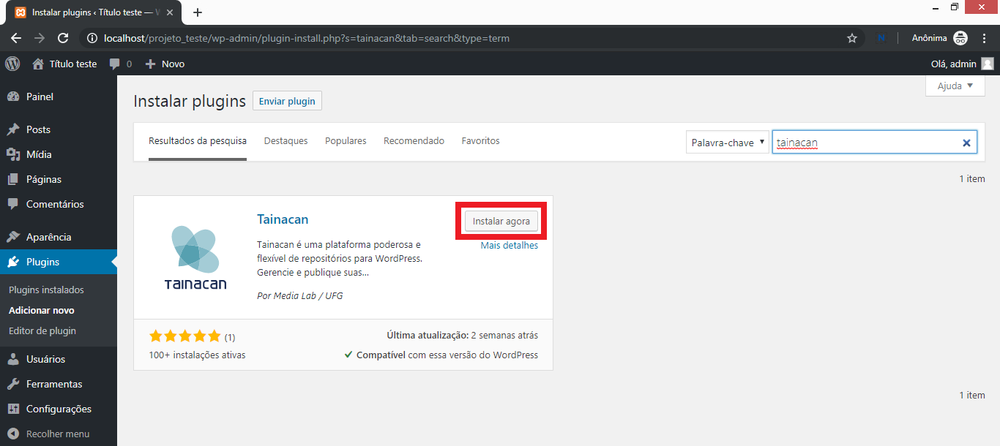
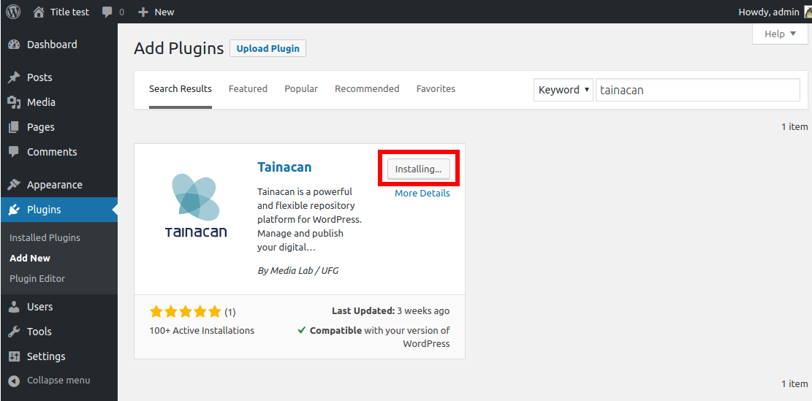
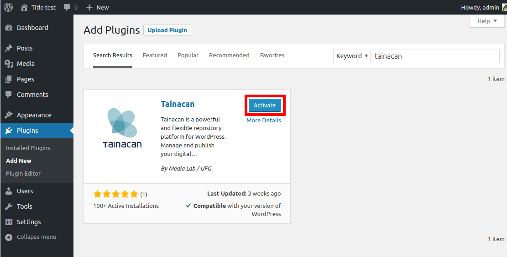

# Cómo instalar el plugin Tainacan en Wordpress

Continuando con la instalación de **Wordpress**, ahora comenzaremos la instalación de **Tainacan**. Si aún no has instalado Wordpress, [consulta este tutorial sobre cómo instalarlo](/es-mx/wordpress.md). Si aún no tiene un servidor web en su máquina local, [vea este tutorial](#acceso-a-la-administración).

Si lo prefiere, puede ver los mismos tutoriales en vídeo:

- [XAMPP](https://www.youtube.com/watch?v=rznX0EZhWG4)
- [Wordpress](https://www.youtube.com/watch?v=7v6qNHmqm0I)
- [Tainacan](https://www.youtube.com/watch?v=qRtoNRUlVkk)

## Acceso a la administración

Hay varias formas de llevar a cabo esta instalación. Este tutorial le mostrará sólo una de ellas.

Para empezar, ve al **Panel de Control** de **Wordpress**, el famoso **admin**. Abre una nueva pestaña en tu navegador y escribe **localhost/project_test/wp-admin** (o el nombre que elijas en lugar de **project_test**). Introduce tu **nombre de usuario** y **contraseña** para iniciar sesión.

  

Esta es la pantalla de **administrar**. Haz clic en **plugins** en la barra lateral de la izquierda, o en **Añadir nuevo** en el submenú que aparecerá.

  

En la pantalla de plugins que aparecerá, busque el campo **Buscar plugins**, como se muestra en la imagen anterior, y escriba **tainacan**.

  

El plugin **Tainacan** aparecerá en los resultados de la búsqueda. Haga clic en el botón **Instalar ahora**, como se muestra en la imagen anterior.

  

El texto del botón cambiará al mensaje **Instalando...**. Espere.

  

Cuando haya terminado de descargar el plugin y se disponga a instalarlo, el texto del botón volverá a cambiar, esta vez a **Activar**. Haz clic en él para continuar el proceso.

  

Ya está. Tainacan ha sido activado y ya puedes verlo en la barra lateral de la izquierda, como se muestra en la imagen superior. Pulsa sobre él para acceder al **Panel de Control** del **plugin**.

  

## El panel de control de Tainacan

Esta es la pantalla principal del Panel de Control de **Tainacan**. Para volver al Panel de Control de **Wordpress**, haga clic en el símbolo de Wordpress en la esquina superior derecha, como se muestra en la imagen de arriba.

  

Ya está. Tainacan está instalado. Ahora sólo tiene que utilizarlo.

  
