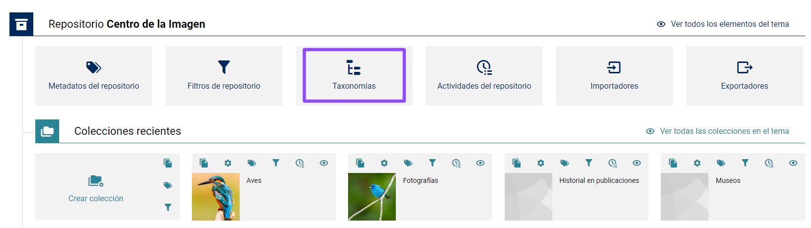
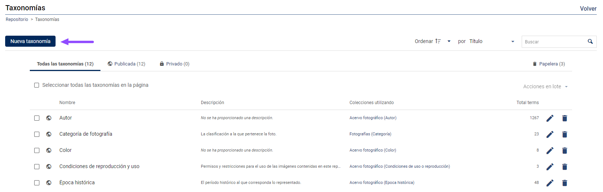
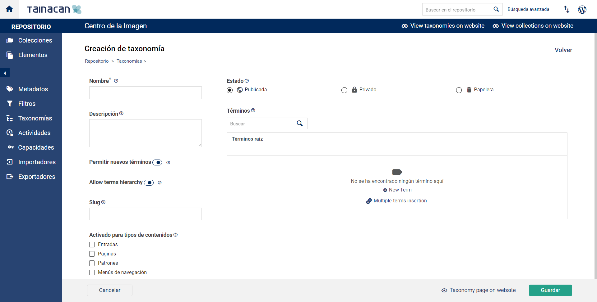
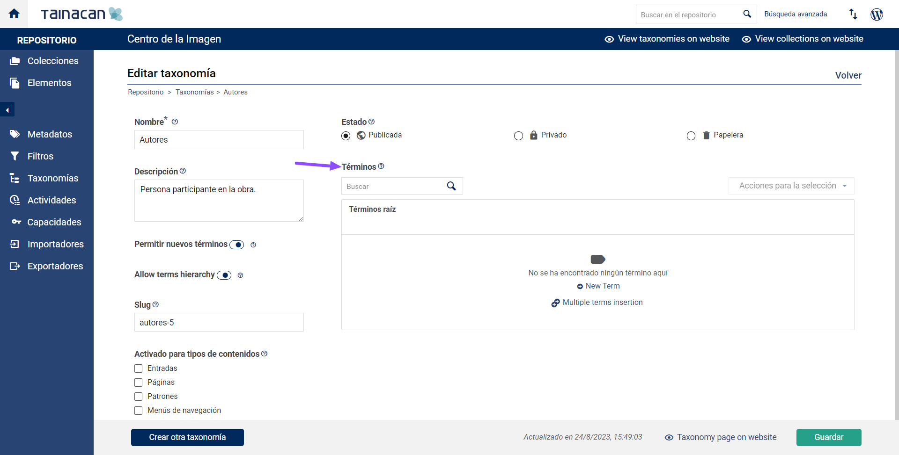
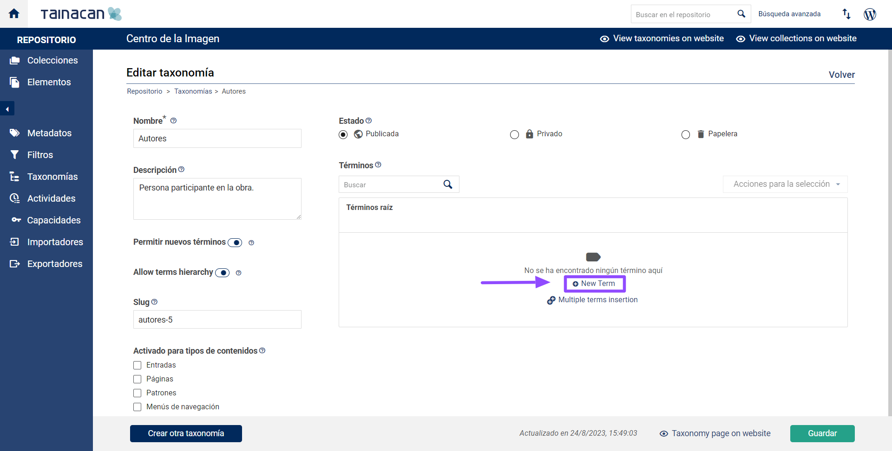
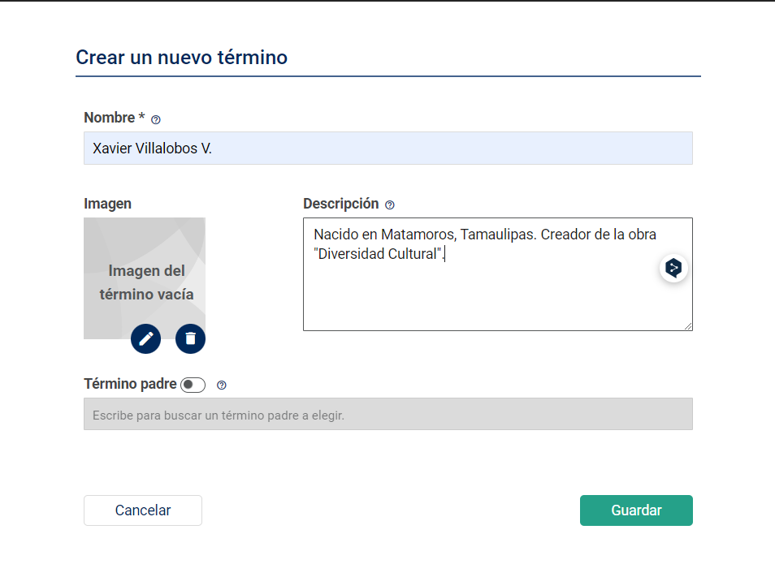
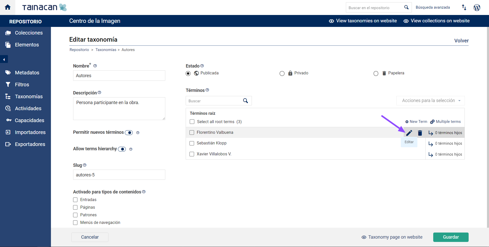
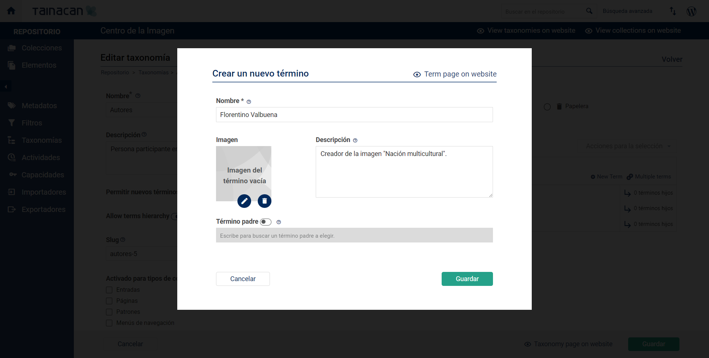
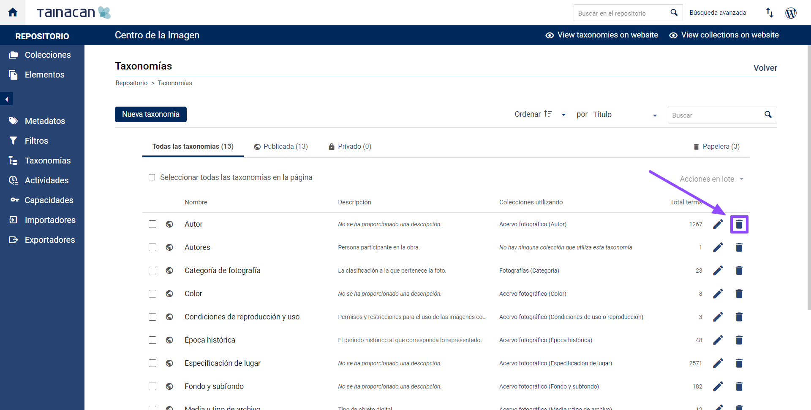
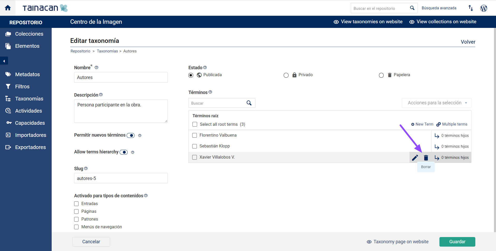

	

# Taxonomías

Las _“Taxonomías”_ son un tipo de metadato que funciona dentro de Tainacan como _“vocabularios controlados”_ que se utilizan para la clasificación de _"elementos"_ y ayudan tanto en la captura de datos como en su correcta recuperación.

> En el lenguaje de WordPress, se habla de _“taxonomías personalizadas”_. Consulta la [documentación de WordPress](https://codex.wordpress.org/es:Taxonom%C3%ADas#Qu.C3.A9_es_una_taxonom.C3.ADa.3F) para saber más.

En Tainacan se pueden crear _“taxonomías simples”_ (se componen de una lista simple de términos) y _“taxonomías con jerarquía”_. Un ejemplo de una _“taxonomía simple”_ puede ser un metadato titulado _“género dramático”_ cuyos _“términos hijos”_ sean _"drama"_, _"comedia"_ y _“tragedia”_. Por su parte, un metadato como _“lugar de origen”_ podría configurarse como una taxonomía con tres niveles jerárquicos: _“País”_ (término padre), _“Estado o Provincia”_ (término hijo) y _“Municipio”_ (término nieto).

Cuando un usuario busque elementos que tengan _“términos hijos”_ (por ejemplo, _“Danza”_), los resultados incluirán _“elementos”_ que tengan cualquiera de los _“términos hijos”_. Por ejemplo, _“Danza ritual”_, _“Danza clásica”_ y _“Danza contemporánea”_.

Los _"términos"_ pueden tener una _"descripción"_, un _"icono"_ o una _"imagen"_ que los represente, y también puede vincularse a un concepto existente en una ontología. Los _"términos"_ tienen su propia _"URL"_ en el sitio web, con una página que enumera todos los _"elementos"_ relacionados con él, incluso si pertenecen a diferentes _"colecciones"_, por lo que se comportan como si fueran una _"recopilación"_ de todos los elementos que comparten un mismo término.

> Las _"taxonomías"_ pueden ser compartidas por varias _"colecciones"_ del repositorio.

> Las _"taxonomías"_ son un _“tipo de metadato”_ que se puede incluir las _"colecciones"_. Ver el tema [Crear Metadatos](es-mx/metadata.md#crear-metadatos) para saber cómo.

<!-- tabs:start -->

### ** Crear **
## Crear Taxonomías

1. Accede al panel de control de WordPress;

   

2. En la barra lateral izquierda, haz clic en Tainacan;

   

3. Da clic en _“Taxonomías”;_

   

4. Da clic en _“Nueva taxonomía”_;

   

5. En la pestaña _“Taxonomía”_ llena los campos deseados:

   

   a) **“Nombre”**: nombre de la _“taxonomía”_;

   b)**“Descripción”**: descripción de la _“taxonomía”_;

   c)**“Slug”**: el **slug** es el texto que se encuentra detrás de la extensión de dominio de una URL y que indica de forma específica un lugar determinado de una página; es la parte editable del dominio Por defecto, se crea a partir del nombre de la _“taxonomía”_, pero se puede editar en este campo (lo ideal de un slug es que sea un texto corto, directo y descriptivo. Favorece el posicionamiento SEO si se optimiza bien);

   d)**“Permitir nuevos términos”**: si se selecciona esta función, permite añadir nuevos términos a la _“taxonomía”_ a medida que se va realizando la catalogación de los _"elementos"_. Si no se selecciona, quien realice la captura no podrá agregar términos, solo podrá elegir algun de los términos ya creados;

   e)**“Estatus”**: permite configurar la _“privacidad de taxonomía”_. Se tiene que elegir uno de los siguientes valores:

   ​ i. **“Publicada”**: La _“taxonomía”_ puede ser vista por los visitantes del repositorio;

   ​ ii. **“Privada”**: La _“taxonomía”_ solo puede ser vista por los editores del repositorio;

   ​ iii. **“Borrador”**: La _“taxonomía”_ solo puede ser vista por su autor o autora;

   ​ iv.**“Papelera”**: La _“taxonomía”_, y sus "términos", ya no se aplicarán a su _"elementos"_ y podrán ser eliminados permanentemente;

   ​ v.**“Habilitado para tipos de post”\*\***:\*_ Permite habilitar esta _“taxonomía”\* para otros tipos de entradas en WordPress.

6. Después de llenar esta información, haz clic en la pestaña _"Términos"_ y después en _"Crear nuevo término"_.

   

### Crear términos

1.Haz clic en "Crear nuevo término";

2.Llena los siguientes campos:

a. **“Imagen de cabecera”**: es posible agregar una imagen que aparezca en la vista "término" de una "taxonomía", según la configuración y el tema adoptado. El tema predeterminado de Tainacan muestra la imagen de encabezado en la página de “término de taxonomía”;

b. **“Nombre”**: el nombre del “término” que formará parte de la “taxonomía”;

c. **“Descripción”**: la descripción del “término” que formará parte de la “taxonomía”;

d. **“Término padre”**: determina el nivel jerárquico del “término” en relación con los demás de la misma “taxonomía”.

3.Haz clic en "Guardar" para terminar de crear el "término".

Hay que repetir la acción de “agregar nuevos términos” por cada término que se desee agregar. También se pueden crear “Taxonomías” desde el “importador de vocabularios”. Consulte Importadores para obtener más información.

### ** Editar **
## Editar taxonomías

1. Accede al “panel de control” de WordPress;

   

2. En la barra lateral izquierda, haz clic en “Tainacan”;

   

3. Haz clic en “Taxonomías”;

   

4. Haz clic en la “taxonomía” deseada en la “lista de taxonomías”:

​ a. Modifica los campos deseados en la "pestaña de taxonomía";

​ b. En la “pestaña de términos” es posible “agregar”, “editar” o “eliminar” términos en esta “taxonomía”.

### Editar términos

1.Accede al “panel de control” de WordPress;

2.En la barra lateral izquierda, haz clic en “Tainacan”;

3.Haz clic en “Taxonomías”;

4.Haz clic en la “taxonomía” deseada en la “lista de taxonomías”;

5.Haz clic en la pestaña "Términos";

6.En la "lista de términos", selecciona el que quieres editar y haz clic en el "icono de lápiz" a la derecha para abrir los campos de edición para este "término";

7.Haz modificaciones en los campos deseados;

8.Haz clic en:

​ a. “Cancelar”, para cancelar la edición del “término”;

​ b. “Ver término”, para visualizar el “término” en el tema;

​ c. “Guardar” para concluir la edición del término.

### ** Eliminar **
## Eliminar taxonomías

1. Accede al “panel de control” de WordPress;

   

2. En la barra lateral izquierda, haz clic en “Tainacan”;

   

3. Haz clic en “Taxonomías”;

   

4. Haz clic en el "icono de papelera" a la derecha de la "taxonomía" que deseas eliminar;

!>**Atención**: Aparecerá un mensaje para confirmar esta acción. La “eliminación de taxonomía” implica también la “eliminación de información” en “metadatos”, “ítems” y “colecciones” que utilizan esta “taxonomía”. Elimina la "taxonomía" solo si estás seguro de que no habrá una pérdida grave de información. Consulta Registro de actividad para obtener más información.

### Eliminar términos

1.Accede al “panel de control” de WordPress;

2.En la barra lateral izquierda, haz clic en “Tainacan”;

3.Haz clic en “Taxonomías”;

4.Haz clic en el "icono de papelera" a la derecha del "término" que deseas eliminar;

!>Atención: se mostrará un aviso para confirmar esta acción. La “exclusión del término” también implica la “exclusión de este valor” en “metadatos”, “ítems” y “colecciones” que utilicen esta “taxonomía”.

<!-- tabs:end -->
