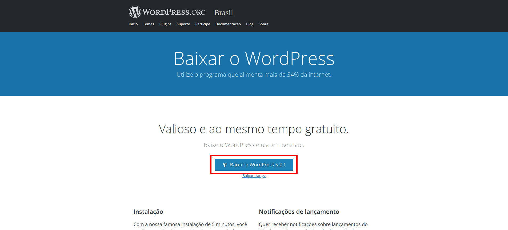
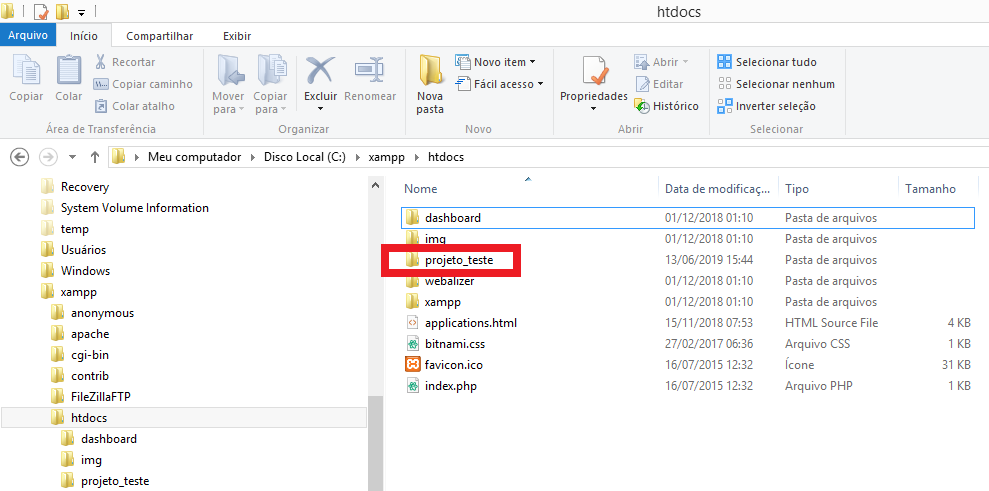
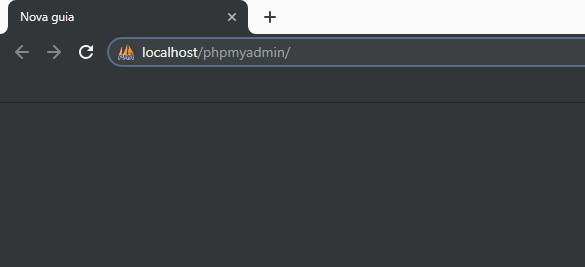
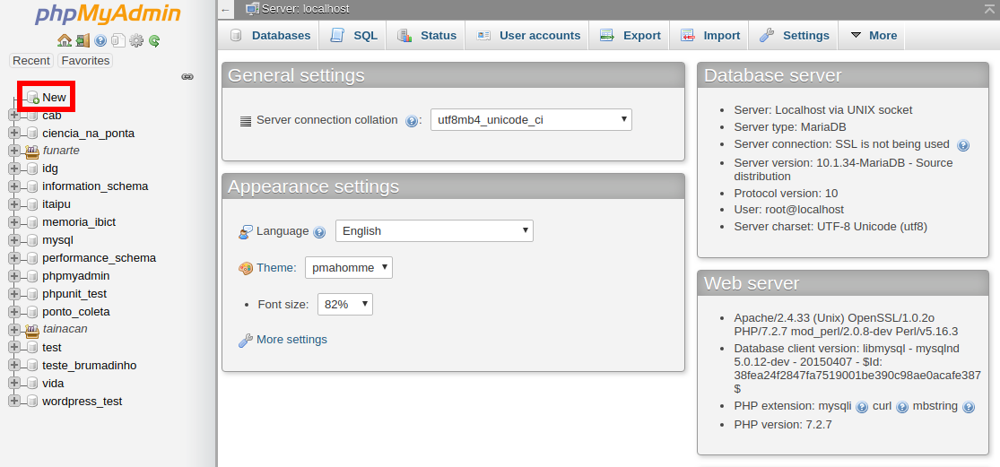
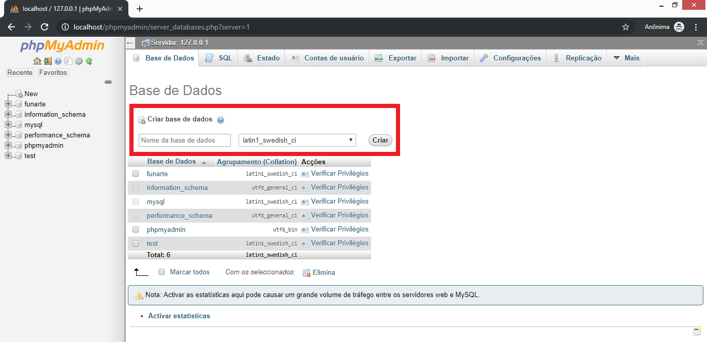
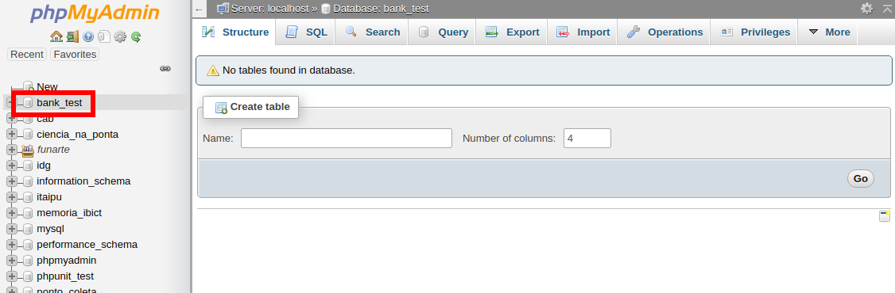
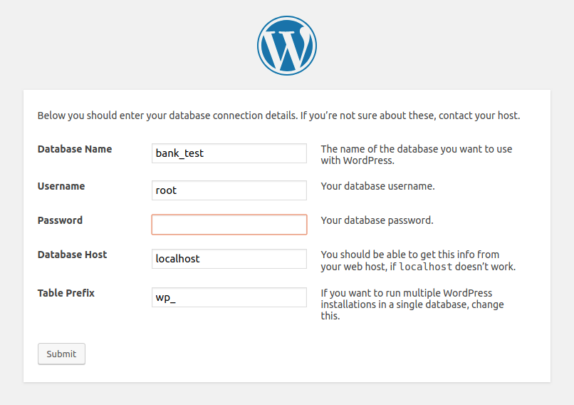
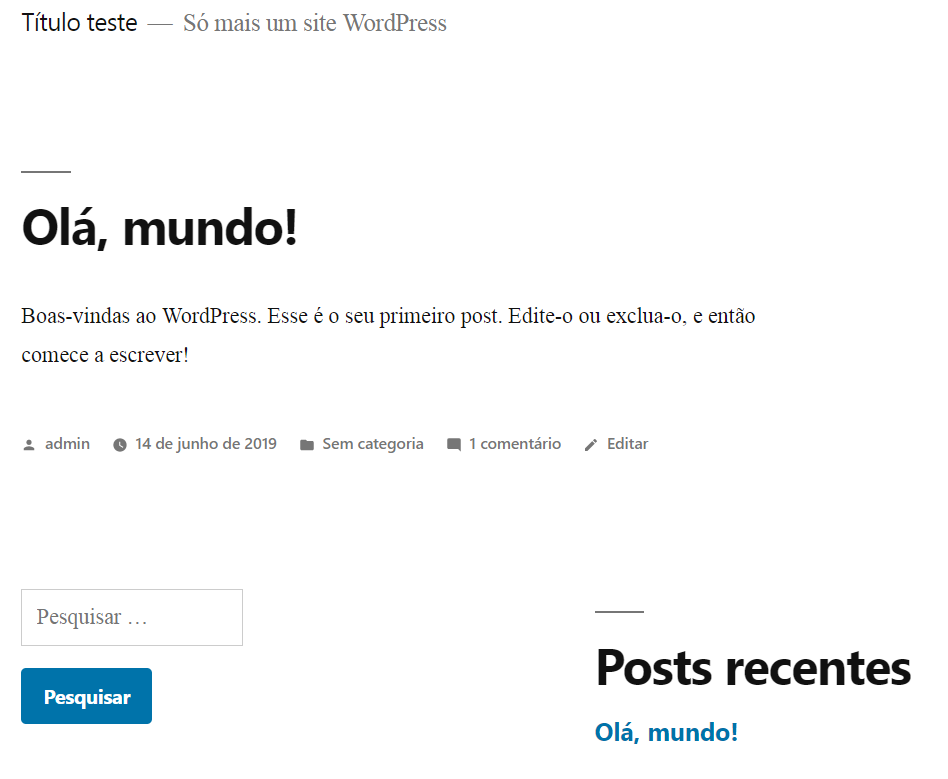

# Como instalar wordpress en un servidor XAMPP (windows)

Continuando con la instalación del servidor web en su máquina local, ahora vamos a instalar **wordpress**. Si aún no has instalado el servidor web, [haz clic aquí para ver el tutorial](/es-mx/xampp#instalando-tainacan-de-forma-local-en-una-computadora-con-windows-sin-servidor).
Para instalar **Tainacan**, [puedes optar por ver este tutorial](/es-mx/tainacan#cómo-instalar-el-plugin-tainacan-en-wordpress).

Si lo prefieres, puedes ver los mismos tutoriales en vídeo:

- [XAMPP](https://www.youtube.com/watch?v=rznX0EZhWG4)
- [Wordpress](https://www.youtube.com/watch?v=7v6qNHmqm0I)
- [Tainacan](https://www.youtube.com/watch?v=qRtoNRUlVkk)

## Descarga

Para empezar, vaya al enlace https://es.wordpress.org/download/ y descargue **wordpress** para **windows**.

En la imagen de arriba, haz clic en **Descargar WordPress 5.2.1** para descargarlo. Una vez finalizado el proceso, iniciaremos la instalación descomprimiendo el archivo descargado.

  

**Descomprimiendo**

En el archivo comprimido, haz clic con el botón derecho del ratón y, a continuación, haz clic en **Extraer todo...**. Espera a que termine la descompresión.

  

Abra la carpeta descomprimida, haga clic con el botón derecho en la carpeta **wordpress** y luego en **Copiar**.

  

Ahora ve a `C:/xampp/htdocs`, haz clic con el botón derecho del ratón dentro de la carpeta y luego haz clic en **Pegar**.

  

Vea la imagen superior de la carpeta, con el proceso de transferencia ya completado.

  

Ahora, para este proyecto, vamos a cambiar el nombre de la carpeta **wordpress** a **test_project**. Siéntase libre de dar a esta carpeta el nombre que desee, preferiblemente el nombre del proyecto que está creando.

  

## Crear una nueva base de datos

Ya está. Wordpress ha sido renombrado y está en el lugar correcto. Ahora necesitamos configurarlo. Para ello, tenemos que crear una base de datos que va a utilizar. Para ello, abra una nueva pestaña en su navegador y escriba en `localhost/phpmyadmin`.

  

Esta es la pantalla de **phpmyadmin**. Aquí puedes cambiar las bases de datos usadas en los proyectos contenidos en **XAMPP**. Ten mucho cuidado de no causar daños aquí. Para crear una nueva base de datos, pulsa el botón **New** (**Nuevo**), en la lista de la izquierda.

  

En esta pantalla, introduciremos el nombre de la base de datos en el campo **Nombre de la base de datos**. Para este ejemplo, utilizaremos el nombre **banco_pruebas**, pero aquí puedes utilizar el nombre que quieras, preferiblemente el nombre del proyecto que estás creando. Cuando hayas terminado de escribir, haz clic en el botón **Crear**.

  

Esta pantalla muestra que el banco ha sido creado y está vacío. Observe su nombre en la lista de la izquierda.

  

## Conectar el banco con el proyecto

Ahora abriremos una nueva pestaña en la siguiente dirección: `localhost/project_test`.
Como es la primera vez que abrimos el sitio, hará los últimos ajustes.

  

Como ya hemos creado la base de datos, podemos hacer clic en **¡Vamos!** para continuar con la instalación.

  

En esta pantalla, debe introducir la siguiente información:

1. El nombre del **base de datos** que acaba de crear;
2. El **nombre de usuario** utilizado para acceder a la base de datos. **XAMPP** utiliza normalmente el nombre de usuario **root**.
3. La **contraseña** utilizada para acceder al banco. **XAMPP** normalmente deja la contraseña en blanco.
4. **No es necesario cambiar el servidor** de la **base de datos** ni el **prefijo de la tabla**.

  

En nuestro caso, los datos son los que se muestran en la imagen superior. Al final, haz clic en el botón **Enviar** situado en la parte inferior de la página.

  

Esta pantalla le informa de que esta parte de la instalación ha finalizado. Haga clic en el botón **Instalar**, como se muestra en la imagen anterior.

  

## Información más reciente

Si todo va bien, aparecerá esta pantalla. Aquí definirás datos como **Título del sitio**, **Nombre de usuario** y **Contraseña** que se utilizarán para acceder al **Panel de control** (**admin**), **email** del administrador del sitio y **opción de visibilidad** en sitios como **Google**. Introduzca todos los campos que considere oportunos y, a continuación, haga clic en **Instalar Wordpress** en la parte inferior de la página.

  

Todo hecho. Ahora Wordpress está instalado. Haga clic en **Acceso** para ver el sitio.

  

## El administrador

Aparecerá la pantalla de acceso al **Panel de Control**, como en la imagen superior. Introduzca el **Nombre de usuario** que haya elegido y la **Contraseña** para iniciar sesión.

  

Este es el **Panel de Control** de **Wordpress**. Todo en el sitio se puede cambiar en las opciones de este panel. Para visualizar el sitio, haga clic en el título elegido en la parte superior izquierda, como se marca en la imagen de arriba.

  

**La página de inicio de wordpress**

Eso es todo. La próxima vez, si quieres acceder directamente al sitio, sólo tienes que ir a la dirección `localhost/project_test` (o el nombre que hayas elegido).
Para acceder directamente al **Panel de Control**, basta con visitar la dirección `localhost/project_test/wp-admin` (o el nombre elegido en lugar de **project_test**).

A continuación, empezaremos a instalar [Tainacan](/es-mx/tainacan#cómo-instalar-el-plugin-tainacan-en-wordpress).

  
