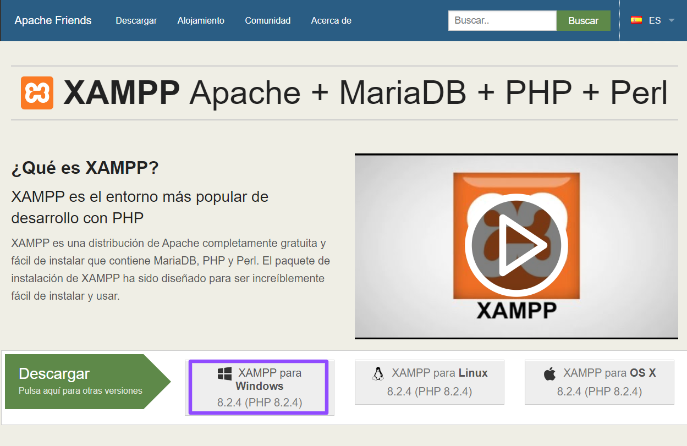
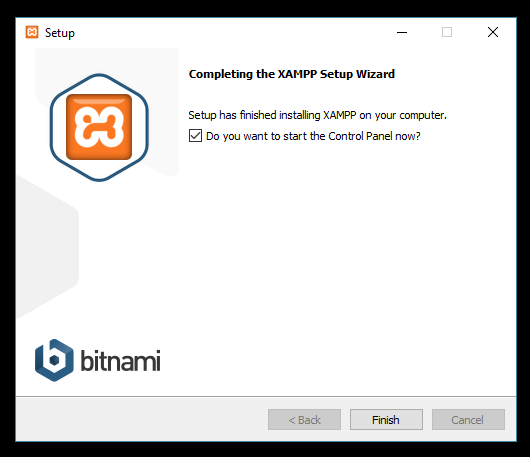
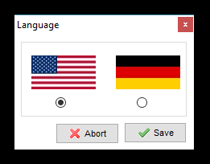
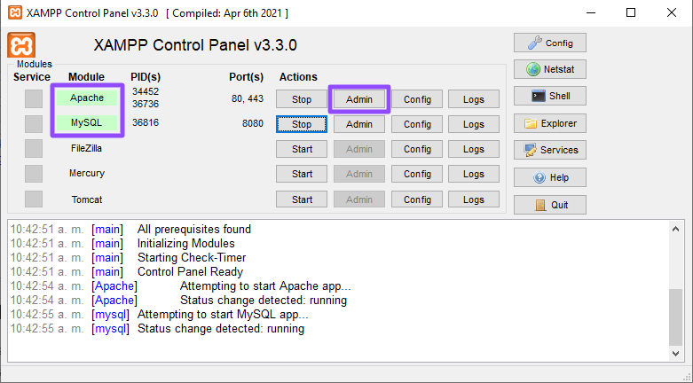
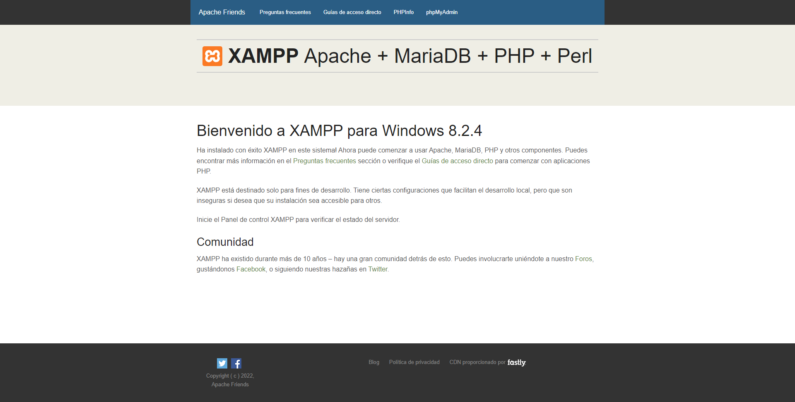
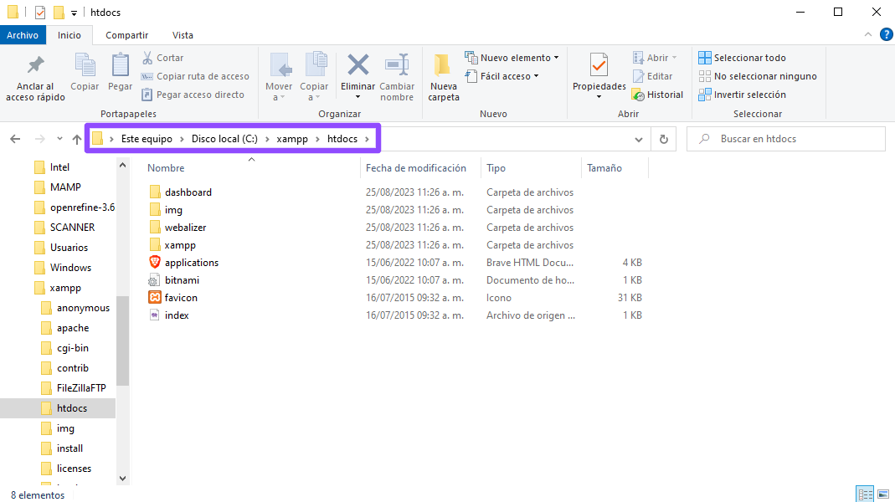

# Instalando Tainacan de forma local en una computadora con Windows (sin servidor) #

**Tainacan** es un complemento (plugin) para **WordPress**. Para utilizarlo, si no tienes nada preparado, deberás realizar tres instalaciones muy sencillas:
1. Un servidor web en tu computadora. Aquí te enseñamos [cómo instalar XAMPP en Windows](#descarga).
2. Una instalación de **WordPress**. Aquí puedes ver [cómo instalar WordPress en un servidor XAMPP (Windows)](/es-mx/wordpress#como-instalar-o-wordpress-no-windows).
3. El plugin **Tainacan**. Aquí te enseñamos [como instalar Tainacan en Wordpress](/es-mx/tainacan#como-instalar-o-plugin-tainacan-no-wordpress).

Si lo prefieres, puedes ver los mismos tutoriales en video:
* [XAMPP](https://www.youtube.com/watch?v=rznX0EZhWG4)
* [WordPress](https://www.youtube.com/watch?v=7v6qNHmqm0I)
* [Tainacan](https://www.youtube.com/watch?v=qRtoNRUlVkk)

## Descarga ##

Para empezar, ve al enlace https://www.apachefriends.org/es/index.html y descarga **XAMPP** para **Windows**.

Como se muestra en la imagen, haz clic en el botón **XAMPP para Windows 7.3.6 (PHP 7.3.6)** para descargarlo. Al finalizar el proceso, iniciaremos la instalación ejecutando el archivo descargado.

 

## Instalación ##

Esta es la pantalla inicial de la instalación. Haz clic en el botón **Next** (**Siguiente**).
Esta pantalla es para seleccionar los componentes que se van a instalar. No es necesario cambiar nada. Vuelve a dar clic en **Siguiente** (**Next**).

 

En esta pantalla, el programa solicita la ubicación de instalación. Una vez más, no es necesario cambiar nada. Haz clic en **Siguiente** (**Next**).

 

En esta pantalla se presenta Bitnami, que es una librería de instaladores. Una vez más, no es necesario cambiar nada. Haz clic en **Siguiente** (**Next**).

 

Este es solo un mensaje de advertencia. La instalación está lista para comenzar. Da clic en **Siguiente** para iniciar el proceso.

 

Ahora el proceso de instalación se está ejecutando. Espera a que la barra de avance se llene por completo.

 

## Abriendo el panel de control ##

El proceso ha concluido y la instalación está completa. Deja la casilla de verificación seleccionada y haz clic en **Finalizar** (**Finish**). Se cerrará la pantalla actual y poco después aparecerá el cuadro del panel de control.

 

Aparece el cuadro de selección de idioma. Elige la primera opción, inglés. Luego haz clic en **Guardar** (**Save**).

 

El cuadro del panel de control se muestra como en esta imagen. Para que el **XAMPP** funcione, es necesario pulsar el botón **Iniciar** (**Start**) de los servicios **Apache** y **MySQL**. NOTA: Estos dos servicios deben estar activados siempre que se utilice el servidor.

 

Si todo va bien, ambos servicios se verán resaltados en verde, como en la imagen de arriba. Ahora haz clic en el botón **Admin**. Se abrirá tu navegador principal (Google Chrome, Firefox, Internet Explorer o el que esté instalado en tu computadora) con la dirección **localhost/dashboard** ya ingresada.

 

## Comprobación ##

Si la instalación se realizó sin problemas, aparecerá la pantalla anterior. Ahora que hemos visto que el servidor funciona correctamente, vamos a la carpeta donde se deben almacenar los archivos para que aparezcan en el navegador.

 

En la imagen de arriba, puedes ver la dirección de la carpeta: **C:/xampp/htdocs** Aquí es donde se encuentran los archivos que se verán en el navegador. ¡Listo, ya tenemos un servidor **XAMPP** funcionando en **Windows**!.

 

Ahora es el momento de empezar a instalar [WordPress](/es-mx/wordpress#como-instalar-wordpress-en-un-servidor-xampp-windows) en tu servidor **XAMPP**.

 
