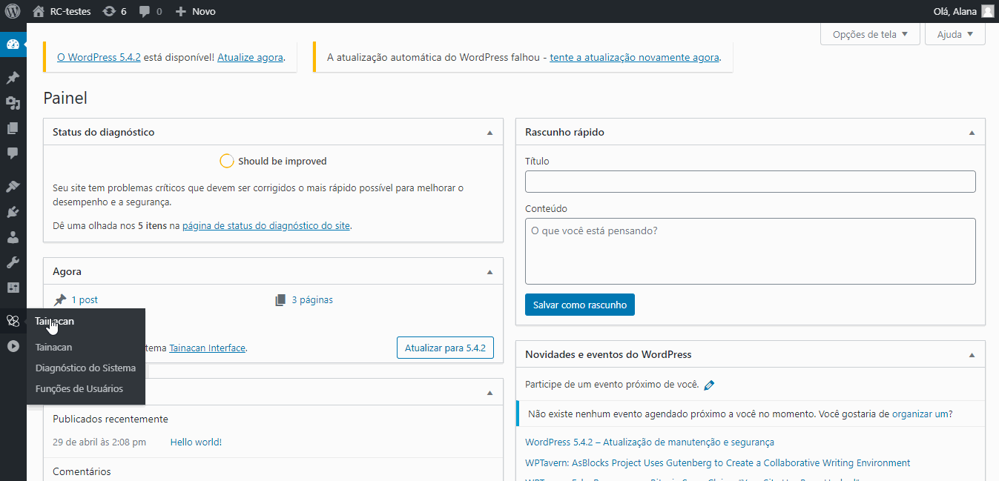

?> ADICIONAR O CAMINHO

# Inserting and Editing Files

There are a few ways to add images to Tainacan items. This action can be performed individually — adding the image directly to the item — or first to the media library, one by one, in sequence, or in bulk. All images used in Tainacan are stored in the WordPress Media Library.

## WordPress Media Library

All images used in Tainacan are stored in the _WordPress_ Media Library. Images can be added to the library first, before attaching them to an item. Editing images can only be done in the Media Library.

### Inserting Images

1. Go to the _WordPress_ Dashboard;
2. In the left sidebar, click `Media` and then `Library`;
3. In the Media Library screen, click `Add New` in the top left corner;
4. Drag or select the image you want to add.


### Editing Images

1. Go to the _WordPress_ Dashboard;
2. In the left sidebar, click `Media` and then `Library`;
3. Select the image you want to edit;
4. Click `Edit Image`;
5. Perform the desired edits:
   - Crop;
   - Rotate Left;
   - Rotate Right;
   - Flip Vertically;
   - Flip Horizontally;
   - Resize Image;
   - Cropping.


---

## Inserting an Image into an Item

Images can be added directly to an item, even if they're not added to the Media Library first. There are three ways to do this:

1. Insert an image individually into each item;
2. Insert images sequentially across a set of items;
3. Insert images in bulk.

Individual insertion is recommended when only a few items require images. Inserting images sequentially works best for a set of items — from a couple to all items on a page. Bulk insertion is ideal for adding images across a large number of items.

### Inserting an Image Individually

1. Go to the _WordPress_ Dashboard;
2. In the left sidebar, click `Tainacan`;
3. Select a collection;
4. Choose the desired item;
5. Click `Edit Item`;
6. Click `File`;
7. Choose an image already in the Media Library or upload one from your computer;
8. Click `Select File`;

   1. At the bottom of the page, a progress bar will display relevant information:
      ```
      * The last time changes were saved.
      ```

9. At the bottom right of the screen, click:
   1. `Move to Trash` to send the item to the trash;
   2. `Revert to Draft` to set the item status to **draft**;
   3. `Update` to confirm changes made;



### Inserting Images in Sequence

1. Go to the _WordPress_ Dashboard;
2. In the left sidebar, click `Tainacan`;
3. Select a collection;
4. Check the boxes for the items you want to edit;

   - [ ] All items on the page can be selected by clicking `Select All Items on Page`.

5. Click `Bulk Actions` and then `Edit Selected Items in Sequence`;
6. Click `File`;
7. Choose an image already in the Media Library or upload one from your computer;
8. Click `Select File`;

   1. At the bottom of the page, a progress bar will display relevant information:
      - Current item and total items;
      - The last time changes were saved;

9. At the bottom right of the screen, click:
   1. `Move to Trash` to send the current item to the trash;
   2. `Revert to Draft` to set the current item status to **draft**;
   3. `Update` to confirm changes made;

10. Click `Next` or `Previous` to move to the next item or return to the previous one;

11. When you’ve finished editing all items, click in the bottom right:
    1. `Complete` to save and finish editing all items;
    2. `Update` to confirm changes made to the current item;
    3. `Save as Draft` to set the current item status to **draft**;
    4. `Previous` to return to the previous item.


### Bulk Image Insertion

> See [Importing files and attachments](/en/importers#importing-files-and-attachments) to learn how to insert images in bulk.