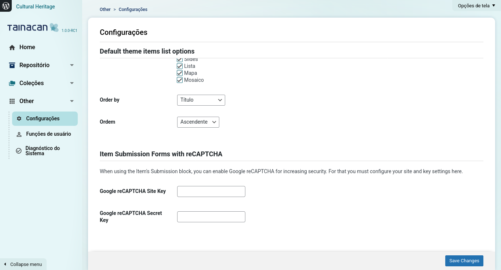

?> _TODO_ This page is in _Brazilian Portuguese_ only so far. **If you can, please help us translate it to _English_.**

# Items Submission

The [version _0.17_](/pt-br/releases#tainacan-beta-017) of Tainacan brings the possibility of opening collections for _public submission_ of items (also referred to as _self-deposit_). This means that users without administrative privileges, or even site visitors, can themselves create items in a Collection, **thus expanding the possibilities of a _collaborative_ collection generated by multiple people**.

Behind the scenes, Item Submission is nothing more than bringing the [item creation form](/pt-br/items#criar-itens), with the [metadata configured in the collection](/pt-br/metadata#tipos-de-metadados), to a public page of the site. This is done through a [Gutenberg block](/pt-br/gutenberg-blocks) and some extra settings. On this page, we explain how to configure your public Item Submission form. We will cover:

1. The necessary adjustments in the [collection configuration](#configurando-a-coleção);
2. The process of [creating the form block](#criando-o-bloco-de-submissão-de-itens);
3. Some [advanced settings](#configurações-avançadas-do-bloco) for the block;
4. Protection against site attacks [using _reCAPTCHA_ verification](#verificação-recaptcha-no-formulário);
5. Some [frequently asked questions](#duvidas-frequentes) about this functionality;

## Configuring the Collection

On the configuration page of every Collection, there is a field that allows enabling item submission. When enabled, new options appear, as shown in the screenshot below:

With this field enabled, this collection can be listed for [the item submission block](#criando-o-bloco-de-submissão-de-itens), which we will discuss shortly. The next field, **"Allow submission by anonymous users"**, concerns which users will be able to submit this form. By default, it is not just anyone visiting the site, but at least people registered in your WordPress system who have this power. If enabled, even people who have never logged into the site will be able to submit information.

?> If you are interested in opening your collection to anonymous users, it is important to understand that the items will not have a record of _"who"_ created them. In the administrative system, the field _"Created by"_ will only contain the information _"anonymous"_. In this case, it may be useful to create Metadata that identifies the **submission author**, such as a Text metadata called "User Name" marked as mandatory.

Every item created by the form will have a **default status**. To ensure that items can be validated before being published in the public collection, it is recommended to keep their status as "Private" or "Draft." The main difference is that draft items do not need to be completed, so not all validation of mandatory metadata, for example, has been done. Private items will only be seen by logged-in users with permission to do so, possibly reviewers in your item approval workflow.

Finally, as with any form on the Web, it is important to protect your site against attacks from malicious users. We detail the functionality of the **Use reCAPTCHA verification in the submission form** option in a separate section.

## Creating the Item Submission Block

To make your form available to site visitors, you need to create a page or post in your WordPress administrative panel. As explained in more detail [on our page about Gutenberg Blocks](/pt-br/gutenberg-blocks), this is the new content editor in WordPress, where you can name the page or even include content to present your form to the user, such as a title and explanatory text. Once this is done, a search for the "Item Submission Form" block in the list of blocks will allow you to insert the form:

Initially, the block is empty because it expects you to configure which collection this form refers to. By clicking the "Select the destination Collection" button, the modal presented will show only the collections configured to accept public item submission, as mentioned [in the previous section](#configurando-a-coleção).

Once the collection is chosen, the block will be filled with a "visual preview" of how the form will look. To actually see the form in action, you need to click Preview or Publish the page.

The form filled out in the example above generated a new private item in the collection, which can then be evaluated and configured as public, if approved, in the Tainacan panel.

## Advanced Block Settings

By clicking on the item submission block and the gear icon in the upper right corner of the screen, the right sidebar of the editor will show a series of block settings. In this section, we will cover them and demonstrate some use cases.

<!-- tabs:start -->

### ** Submission Return Message **

This setting concerns the message that will be displayed when the item has been successfully submitted in the form. By default, this information appears as shown in the image below:

It can be a good place to inform, for example, that the submission is being evaluated by the administrative team and that if approved, the item will be made available in the collection's item listing.

### ** Section Labels **

As can be seen in the block preview, the item submission form has four main sections, in the following order:

1. The **Main Document** of the item, which can be either a file, plain text, or an online address via URL link;
2. The **Thumbnail**, which will represent the item in listings and is automatically generated from the Document by default but can be submitted by the user;
3. The **Attachments list**, which can consist of one or more files related to the item in some way;
4. The **Metadata list**, which constitutes the general information of the item and gives structure to the data required by the form.

These labels may make sense in Tainacan's administrative interface, but you might prefer to use terms that better communicate with your audience. For example, perhaps _"Information"_ is clearer than _"Metadata"_ and _"Extra files"_ is better than _"Attachments"_. For this reason, you can change these labels in this section. You can also choose to leave them blank, which will hide these separations between the sections, giving a sense of unity to the form fields.

### ** Metadata Entry **

In the Metadata Entry panel, you can see all the fields that have been configured on the metadata screen in the collection configuration. Here you can hide some metadata that you do not consider appropriate to appear on this form. For example, a field that keeps the information of whether that item was approved after review certainly does not need to be on the public form!. Note, however, that if the metadata in question is mandatory, it cannot be disabled, as this would prevent submission.

### ** Form Elements **

This panel groups all the functionalities to hide/show the other form elements that are not metadata. Using these options, you can bring the layout of your form closer to that of a simpler form on your site, instead of resembling the complex and rich component found in Tainacan's administrative panel:

1. Hide any round button for choosing the document type. Hiding all three, the session with the label will cease to exist. Hiding two out of three of these, the form will stop displaying the round buttons and will immediately display the field for inserting the document of the only remaining type:
   1. Document type file;
   2. Document type plain text;
   3. Document type URL;
2. Hide the Thumbnail session - useful if you want to rely on the automatic generation process from the document or if your items are mostly textual and do not require an image;
3. Hide the Attachments session - if your items do not need them;
4. Show the "Allow comments" button. This is the only element of the item form that is hidden by default. In the curious case where you want the user to decide whether their item can receive comments or not, enable this option;
5. Hide the metadata collapsibles - The entire metadata list has arrows next to the names and lines below the inputs that denote the collapsibles, buttons that when clicked hide that metadata, for better space utilization. If you prefer that this functionality does not appear, use this option. It should be ideal if your form has few metadata;
6. Hide the help buttons - Next to every metadata and form section, a small round button with a question mark offers the user a balloon with filling tips. These tips come from the configuration of each metadata, from the description field. If you consider that the information is not necessary here, you can disable them with this option;
7. Hide the metadata type - Every metadata field in the form has, next to its label, a lighter text indicating the metadata type (text, relationship, number, taxonomy...). This information may not be interesting in the public form, so it can be disabled here.

### ** Colors and Sizes **

Finally, it is possible to change some of the appearance of the form. Although the aesthetics of the components may vary according to the theme used, some adjustments can be made in this panel. It may be desirable to modify the base font size (the font used in the administrative panel is typically smaller than that found in posts and pages) and of course, colors in general. The colors consist generally of variations of gray to show lines and text and two primary colors that come from Tainacan's Turquoise Blue interface. These are important for links, buttons, help balloons, and mouse-over effects on items. It is worth observing the resulting effects in the block preview to get an idea.

<!-- tabs:end -->

## Verificação reCAPTCHA no formulário

É muito comum, em sites que possuem formulários como estes, que usuários mal intencionados realizem ataques ao servidor. Uma das maneiras mais comuns de se realizar isso é fazendo uso de robôs (scripts automatizados) que submetem diversas vezes informações ao formulário, seja com objetivo de espalhar SPAM, seja com objetivo de sobrecarregar o servidor e possivelmente derrubá-lo.

Para proteger seu site deste tipo de ataque, recomendamos fortemente o uso de um mecanismo de verificação que consiga validar submissões feitas por usuários reais. Embora existam diversas soluções para isso, oferecemos integrada ao plugin aquela consideramos uma das mais simples e eficazes, o [reCAPTCHA da Google](https://developers.google.com/recaptcha/ ":ignore"). Você provavelmente já topou com ele algum formulário na web onde teve que apertar seu checkbox e realizar algum desafio para seguir a diante com a submissão. São dois passos para fazê-lo funcionar no seu formulário de submissão de itens:

1. [Configurar o site](#configurando-o-recaptcha-no-seu-site) para obter a chave do reCAPTCHA;
2. [Habilitar a coleção](#habilitando-a-coleção-para-uso-do-recaptcha) para uso do mesmo;

### Configurando o reCAPTCHA no seu site

No painel administrativo do WordPress, há um submenu do plugin Tainacan específico para isso, o "Submissão de Itens". Acessando ele, você encontrar dois campos que precisam ser preenchidos: A _chave do site_ e a _palavra secreta do site_.

Ambos os campos são obtidos no site do reCAPTCHA, quando vc cadastra seu site neste link: [https://www.google.com/recaptcha/admin/create](https://www.google.com/recaptcha/admin/create ":ignore"). Não esqueça de clicar em "Salvar alterações" ao concluir esta etapa.

### Habilitando a Coleção para uso do reCAPTCHA

Nas configurações relacionadas ao formulário de submissão dentro do formulário da coleção, habilite a opção que diz "Usar a verificação reCAPTCHA no formulário de submissão". Feito isto, salve a coleção.

?> Note que se você já havia criado um bloco de submissão antes de realizar estas configurações, será preciso excluir ele e refazer a inserção do bloco;

## Duvidas Frequentes

### Onde configuro quais perguntas vão existir no formulário?

O formulário de submissão de itens oferecido nada mais é do que um mapeamento do formulário de edição de itens existente na sua coleção. Portanto, para configurar quais campos vão existir no mesmo, é preciso editar os metadados da sua coleção. Na página dos metadados, você poderá mexer com a ordem destes, os rótulos, descrições e particularidades tais como serem ou não obrigatórios. Mais informações [nesta página](/pt-br/metadata).

### Como montar um fluxo de validação para as submissões?

Não há um identificador específico que diga que "Este item veio de uma submissão". Por padrão itens submetidos via formulário serão enviados para a aba da lista de itens relativa ao [status configurado na coleção](#configurando-a-coleção). Esta é a maneira que você tem de assegurar que eles não se tornem públicos de imediato e possam antes ser revisados e aprovados. O que é possível é criar um metadado privado do tipo Seleção ou Taxonomia (que não apareça no formulário) e que te ajude a identificar possíveis subetapas de um fluxo de aprovações (como "Em avaliação", "Falta revisão"), antes dele ser definitivamente aprovado.

### Não estou conseguindo criar termos novos pelo formulário, por quê?

Por enquanto, não é possível criar novos termos de metadados tipo taxonomia diretamente pelo formulário de submissão do item. Esta limitação existe porque Taxonomias são configurações a nível repositório e precisam de uma camada extra de segurança para que usuários externos não tragam problemas aos seus vocabulários controlados. Entretanto, a funcionalidade está aberta a discussão para desenvolvimento futuro.

### Quero um formulário com campos não relacionados à coleção. É possível?

O módulo de submissão de itens é voltado para itens de coleções Tainacan. Se você deseja obter uma informação de seu usuário e não considera esta uma informação de uma coleção em específico do seu repositório, talvez o que você precise seja um plugin de formulário para o seu site. Existem [diversos disponíveis para o WordPress](https://br.wordpress.org/plugins/search/form/ ":ignore") que podem inclusive ser inseridos na mesma página do seu bloco de submissão de itens, porém deixando claro que se tratam de informações separadas.

### Já uso um plugin de reCAPTCHA. Existe alguma integração com a submissão de itens?

De fato, existem [alguns plugins que já habilitam o reCAPTCHA](https://br.wordpress.org/plugins/search/reCaptcha/ ":ignore") na maioria dos formulários do seu site. Estes plugins entretanto não se integram automaticamente no Taiancan. Porém, uma vez usando eles, você pode aproveitar a _chave do site_ e a _palavra secreta_ gerada para eles e copiar e colar nos [campos de configuração](#configurando-o-recaptcha-no-seu-site), assim todos estarão protegidos pelo menos mecanismo e você pode inclusive acompanhar estatísticas de ataques e proteções no painel administrativo do Google reCAPTCHA.
