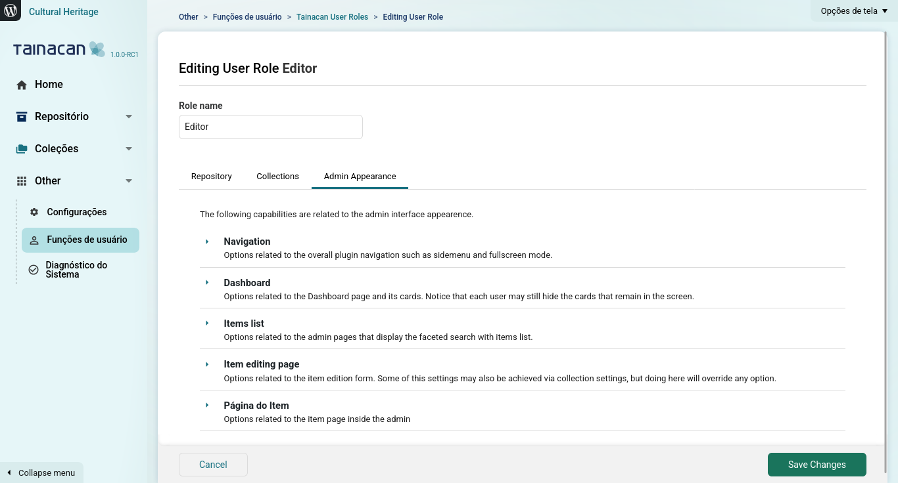
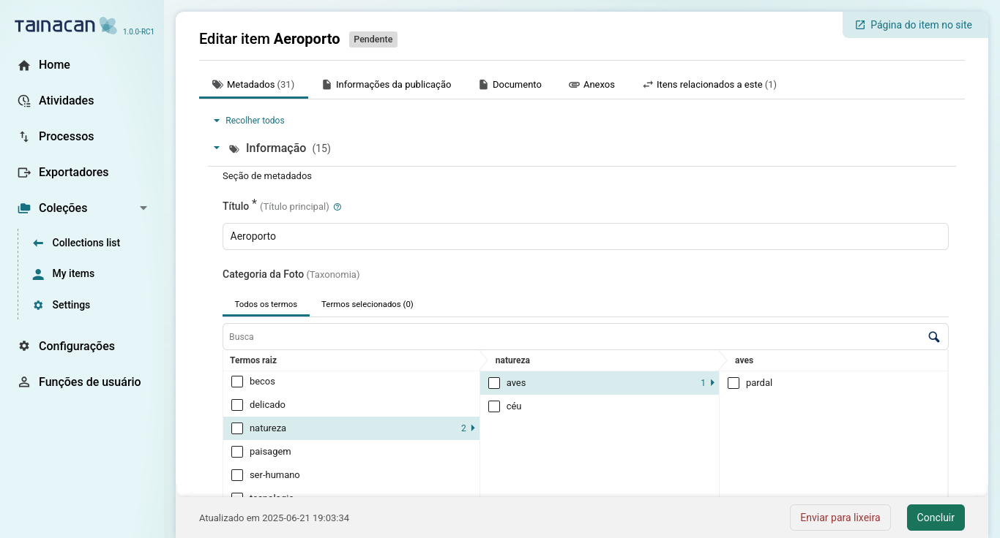

# Admin Appearance

> [!NOTE]
> Esta página está em Inglês. Se você puder, ajude-nos a traduzir para Português!

Since Tainacan `1.0.0` Administrators or user with the `tnc_rep_edit_users` capability can style certain aspects of the Tainacan Admin Appearance in an advanced *per-user-role* basis. This means mostly hiding elements, controlling certain default features (such as the presence of the WordPress Admin menu) and dashboard cards.

As explained in our [Roles and Capabilities](./manage-user-roles.md) page, you can edit a User Role by accessing Tainacan Admin menu -> "Others" -> "User Roles". From the Roles list, you select to edit the desired role. The options stored in the "Repository" and "Collection" tabs have a more strict control on the access and modifiability of certain Tainacan data, however there are certain cases where you'll want to tweak things in a more aesthetic way.

> [!NOTE]
> **For example**: an *Author* may have no capabilities to edit any Taxonomy, however he/she/they can see the Taxonomies in the Admin UI. Because they are able to select terms for related metadata. Tainacan takes care of disabling the editing functionality itself (for example, *hiding edit buttons*) but it won't hide the Taxonomies page from the Admin, because the user is allowed to see Taxonomies there, at lease those that are public. *This is the kind of situation where you may want to hide this option from an appearance perspective: **to clear the UI***.  

## Available options

Here is an overview of the kind of options that you'll find there:

### Navigation

Options related to the overall plugin navigation such as sidemenu and fullscreen mode. Remember that some options here might override each other and that they are applied only when you save the form.

 - **Force Tainacan to always overlap WordPress admin menu and sidebar** - This means that no "Screen options" button will appear at the top of the Admin pages and the user will start with this "fullscreen" version of the plugin pages, like it used to be in versions before `1.0.0`.
 - **Hide breadcrumbs**
 - **Hide WordPress shortcut button** - This locks the user in the plugin interface, making it harder to navigate back to the WordPress admin. It may be desired if your used has no business in the remaining WordPress UI.
 - **Hide site shortcut button**
 - **Hide fullscreen toggler button** - This only hides the screen option to "Hide the WordPress Admin" but does not change it's currently selected state. 
 - **Hide menu collapser button** - This is the button at the bottom left corner which is used to shrink the sidemenu.
 - **Hide entire navigation side menu** - To be used in very strict and radical cases where you'll want to lock user in a navigation flow based only in breadcrumbs and internal links.
 - **Hide home button in side menu** - Hides the link to Dashboard. Notice that the Logo still links to it.
 - **Hide "Repository" menu button in side menu** - This hides the "Repository" menu collapser only, promoting its inner content to first-level menus. If you want to its content, you'll have to disable one by one.
 - **Hide `something` button in repository submenu** - Removes access to a certain repository-level page.
 - **Hide "Collections" menu button in side menu** - Differently to the "Repository" one, this also hides the inner content. That is due to their dynamic nature. It may be desired only in rare situations where a user is responsible only for managing administrative aspects of the repository instead of the main content, which is usually inside the collections.
 - **Hide collections list button in collections submenu**
 - **Hide "All items" button in collections submenu** - Hides the Repository-level access to all items across collections. 
 - **Hide "My items" button in collections submenu** - Hides the filtered version of the Repository-level items list where only items created by the current user are shown. 
 - **Hide collection name in current collection submenu** - When a collection is selected, its menu options appear above the collection name in the sidemenu. This option allows to hide it.
 - **Hide "All items" button in current collection submenu** - Hide the default link to the Collection-level items list. If this is hidden and the "My items" remain visible, the second will be the default page to there items editing flow shall return.
 - **Hide "My items" button in current collection submenu** - Hides the filtered version of the Collection-level items list where only items created by the current user are shown. 
 - **Hide settings button in current collection submenu**
 - **Hide `something` button in current collection submenu** - Removes access to a certain collection-level page.
 - **Hide external site links for item, collection, taxonomies and other public pages** - This removes the buttons that are usually present at the top right bottom of the page in certain pages such as collection, taxonomy, item, etc, that link to the public-side version of that entity in the site.
 - **Hide "Other" menu button in side menu** - This removes only the "Other" collapse, promoting its inner content to first-level menus. To hide its content you must disable them individually.
 - **Hide "Settings" button in side menu**
 - **Hide "Roles" button in side menu**
 - **Hide "System Check" button in side menu** 

### Dashboard

Options related to the Dashboard page and its cards. Notice that each user may still hide the cards that remain in the screen.

- **Disable dashboard cards sorting**
- **Hide repository card**
- **Hide repository card `something` button** - Use it to hide links that you don't like from the Repository card.
- **Show repository card `something` button** - Use it to enable links that you would like to have in the Repository card.
- **Hide collections card**
- **Hide collections card `something` button** - Use it to hide links that you don't like from the Collections card.
- **Hide collection cards**
- **Show only collections that user can edit items** - This will load only Collection cards for which the user can edit items. By default any collection that the user can see is shown.
- **Show only collections authored by the user** - This will load only Collection cards for which the user is author.
- **Hide collection cards `something` button** - Use it to hide links that you don't like from a single Collection card.
- **Show collection cards `something` button** - Use it to enable links that you would like to have in a single Collection card.
- **Hide info card**
- **Hide info card `something` button** - Use it to hide links that you don't like from the Info card.
- **Show info card <<somthing>> button** - Use it to show links that you would like to have int the Info card.
- **Hide news card**

### Items list

Options related to the admin pages that display the faceted search with items list. These settings can make the page less polluted and hide options that can cause server load like bulk editions.

- **Hide page title**
- **Hide bulk actions button**
- **Hide multiple item selection**
- **Hide individual item selection**
- **Hide "View as..." button**
- **Hide view mode selector button**
- **Hide displayed metadata dropdown**
- **Hide advanced search**
- **Hide status tabs**
- **Hide total items in status tabs**
- **Hide bulk add button in creation dropdown**
- **Hide import button in creation dropdown**
- **Hide right-click context menu**
- **Hide create filters button**
- **Hide "Go to page" button**
- **Hide "Items per page" button**

### Item editing page

Options related to the item edition form. Some of this settings may also be achieved via collection settings, but doing here will override any option. While some options clear the UI, others change it to a tabbed layout.

- **Hide page title**
- **Show publication section inside tabs**
- **Show document entry inside tabs**
- **Show attachments inside tabs**
- **Hide publication section**
- **Hide status options**
- **Hide publish status option**
- **Hide private status option**
- **Hide pending status option**
- **Hide comments option**
- **Hide document entry completely**
- **Hide file type document entry**
- **Hide text type document entry**
- **Hide URL type document entry**
- **Hide thumbnail**
- **Hide attachments**
- **Show status option in footer dropdown** - This puts the status selector back to a place where it used to be in previous versions, mixed with the "Finish" button as a dropdown.
- **Allow item creation modal inside another modal (experimental)**

### Item page

Options related to the item page inside the admin. Most of this exist to make a mirror to the Item editing page choices, as this is the page that you see inside the Admin when you are visiting, but not editing an item.

- **Hide page title**
- **Hide status**
- **Hide visibility status**
- **Hide comments condition**
- **Hide document**
- **Hide thumbnail**
- **Hide attachments**
- **Hide activities**
- **Hide "View as..." button**

## Possible outcomes

Here is an example of how far you can get with customizations as the ones mentioned above:

> [!WARNING]
> As much powerful as these settings are, we advice to use it carefully. For starters, as we mentioned, some options conflict with each other or with existing controls (collection-level settings, user-role-level capabilities), which may put you into confusing situations. Also deviating from the original UI for some users and not for others may implicate in having to educate users in different ways according to their profile. The navigation features are specially risky because they affect how part of the browsing flow was originally planned in the Admin. Some of the options above are even a bit experimental, which means we may consider changing it in the future. 

## Overridden options

All of the options listed here may be overridden by a plugin or theme if it's developer implemented one of our filters. To learn and understand how this works, read [our developers documentation](/dev/admin-ui-options.md).