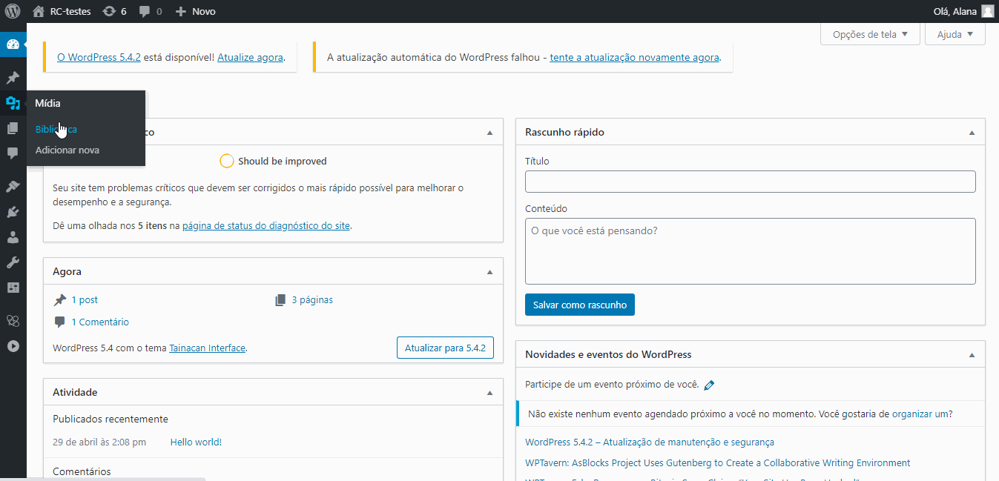

# Inserir e editar imagens

Existem algumas formas de adicionar imagens aos _“itens”_ do Tainacan. Esse tipo de ação pode ser realizada individualmente, adicionando a imagem direto ao item ou primeiro à biblioteca, em sequência ou em massa. Sendo que, todas as imagens utilizadas no Tainacan se encontram alocadas na _“Biblioteca de Mídia do WordPress”_.

## Biblioteca de mídia do WordPress

Todas as imagens utilizadas no Tainacan ficam armazenadas na _“Biblioteca de Mídia do WordPress”_. As imagens podem ser incorporadas diretamente à biblioteca antes de serem adicionadas a um _“item”_. As edições nas imagens só podem ser realizadas na _“Biblioteca de Mídia”_.

### Inserir imagens

1. Acesse o _“painel de controle”_ do WordPress;

2. Na barra lateral esquerda, clique em _“Mídia”_ e então em _“Biblioteca”_;

3. Na tela da _“Biblioteca de mídia”_ clique em _“Adicionar nova”_ no canto superior esquerdo;

4. Arraste ou selecione a _“imagem”_ que deseja adicionar.

   

### Editar imagens

1. Acesse o painel de controle do _WordPress_;

2. Na barra lateral esquerda clique em `Mídia` e então em `Biblioteca`;

3. Selecione a imagem que deseja editar;

4. Clique em `Editar imagem`;

5. Realize as edições desejadas:

   **“Recortar”**;

   **“Rotacionar para a esquerda”**;

   **“Rotacionar para a direita”**;

   **“Virar na vertical”**;

   **“Virar na horizontal”**;

   **“Redimensionar a imagem”**;

   **“Recorte da imagem”**.

---

## Inserir imagem ao item

As imagens podem ser inseridas diretamente ao item, sem que antes sejam adicionadas a Biblioteca de mídia. Existem três formas de realizar essa ação:

1. **Inserir a imagem individualmente em cada item;**
2. **Inserir imagens em sequência em um conjunto de itens;**
3. **Inserir imagens em massa.**

A ação de inserir imagens individualmente é indicada para os casos em que existem poucos itens em que imagens serão adicionadas. A inserção de imagens em sequência é adequada para um conjunto de itens, que pode abranger de dois até todos os itens de uma mesma página. Já a inserção de imagens em massa visa abranger uma grande quantidade de itens.

### Inserir imagem individualmente

1. Acesse o painel de controle do _WordPress_;

   

2. Na barra lateral esquerda, clique em _“Tainacan”_;

   

3. Selecione uma coleção;

4. Selecione o _“item”_ desejado e clique em _“Editar item”_;

   

5. Clique em _“Arquivo”_;

   

6. Selecione uma _“imagem”_ que já se encontra na _“Biblioteca de mídia”_ ou envie uma _“imagem”_ do seu computador;

   <iframe
       width="560"
       height="513" 
       src="https://www.youtube.com/embed/M24K-V_FmMw" title="YouTube video player"
       frameborder="0"
       allow="accelerometer; autoplay; encrypted-media; gyroscope; picture-in-picture"
       allowfullscreen>
   </iframe>

7. Clique em _“Selecionar arquivo”_;

   No _“rodapé da página”_ é exibida uma barra de progresso com as informações referentes:

   \* Última vez que as alterações realizadas foram salvas.

   <iframe
       width="560"
       height="513" 
       src="https://www.youtube.com/embed/Eshy6yVO8Nw" title="YouTube video player"
       frameborder="0"
       allow="accelerometer; autoplay; encrypted-media; gyroscope; picture-in-picture"
       allowfullscreen>
   </iframe>

8. No canto inferior direito da tela clique em:

   

   1. **“Enviar para a lixeira”**, para que o _“item”_ seja enviado para a lixeira;
   2. **“Voltar para rascunho”**, para que o _“item”_ tenha seu _status_ alterado para _“rascunho”_;
   3. **“Atualizar”**, para confirmar as alterações realizadas no “item”;
   4. No rodapé da página é exibida uma barra de progresso com as informações referentes:

### Inserir imagem em sequência

1. Acesse o _“painel de controle”_ do WordPress;

   

2. Na barra lateral esquerda, clique em _“Tainacan”_;

   

3. Selecione uma _“coleção”_;

4. Clique nas _“caixas de seleção”_ dos _“itens”_ que deseja editar;

   I. Todos os “itens” da página podem ser selecionados ao clicar em “Selecionar todos os itens da página”.

   <iframe
       width="560"
       height="513" 
       src="https://www.youtube.com/embed/SWJlSRaveZ4" title="YouTube video player"
       frameborder="0"
       allow="accelerometer; autoplay; encrypted-media; gyroscope; picture-in-picture"
       allowfullscreen>
   </iframe>
   
5. Clique em “Ações em massa” e então em “Editar itens selecionados em sequência”;

   

6. Clique em “Arquivo”

   

7. Selecione uma “imagem” que já se encontra na “Biblioteca de mídia” ou envie uma “imagem” do seu computador;

8. Clique em “Selecionar arquivo”;

   I. No “rodapé da página” é exibida uma barra de progresso com as informações referentes;

   i. Item atual e total de itens;

   ii. Última vez que as alterações realizadas foram salvas;

   <iframe
       width="560"
       height="513" 
       src="https://www.youtube.com/embed/M24K-V_FmMw"
       frameborder="0"
       allow="accelerometer; autoplay; encrypted-media; gyroscope; picture-in-picture"
       allowfullscreen>
   </iframe>

9. No canto inferior direito da tela, clique em:

   I. “Anterior”, para voltar ao “item” anterior;

   II. “Salvar como Rascunho”, para que o “item” exibido tenha seu status alterado para “rascunho”;

   III. “Atualizar”, para confirmar as alterações realizadas no “item” e ir para o próximo.

   

### Inserir imagem em massa

> Consulte [Importando arquivos e anexos](/pt-br/importers#importar-arquivos-e-anexos) para aprender como inserir imagens em massa.
