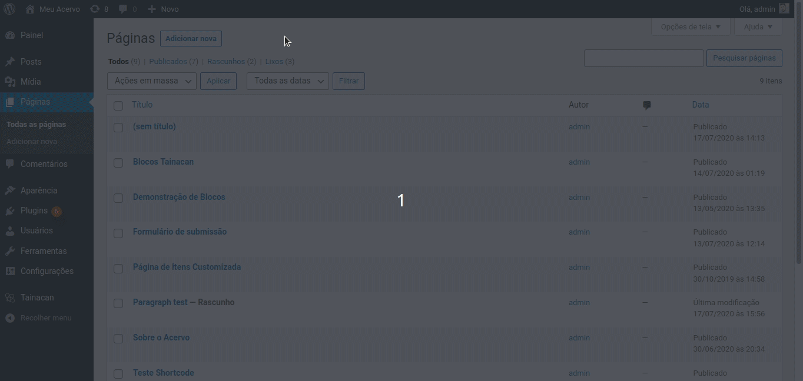
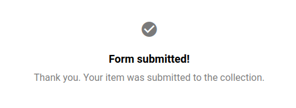

# Submissão de Itens

A [versão _0.17_](/pt-br/releases#tainacan-beta-017) do Tainacan trás a possibilidade de se abrirem coleções para _submissão pública_ de itens (também referida como _auto-depósito_). Isto significa que usuários sem privilégios administrativos, ou até mesmo visitantes do site passam a poder eles mesmos criarem itens em uma Coleção, **ampliando assim as possibilidades de um acervo _colaborativo_ gerado por diversas pessoas**.

Por trás dos panos, a Submissão de Itens nada mais é do que levar o [formulário de criação do item](/pt-br/items#criar-itens), com os [metadados configurados na coleção](/pt-br/metadata#tipos-de-metadados), para uma página pública do site. Isto é feito através de um [bloco gutenberg](/pt-br/gutenberg-blocks) e de algumas configurações extras. Nestas página, explicamos como configurar seu formulário de Submissão de Itens público. Cobriremos então:

1. Os ajustes necessários na [configuração da coleção](#configurando-a-coleção);
2. O processo de [criação do bloco do formulário](#criando-o-bloco-de-submissão-de-itens);
3. Alguns [ajustes avançados](#configurações-avançadas-do-bloco) para o bloco;
4. A proteção contra ataques ao site [usando a verificação _reCAPTCHA_](#verificação-recaptcha-no-formulário);

## Configurando a Coleção

Na página de configuração de toda Coleção, há um campo que permite habilitar a submissão de itens. Ao habilitá-lo, novas opções surgem, como mostrada na captura de tela a seguir:

Com este campo habilitado, esta coleção poderá ser listada para [o bloco de submissão de itens](#criando-o-bloco-de-submissão-de-itens), sobre o qual falaremos em breve. O campo seguinte, **"Permitir a submissão por usuários anônimos"**, diz respeito a quais usuários poderão enviar este formulário. Por padrão, não é qualquer pessoa que visita o site, mas pelo menos pessoas cadastradas no sistema do seu WordPress que tem este poder. Se habilitado, mesmo pessoas que nunca logaram no site poderão enviar informações.

?> Se estiver no seu interesse abrir sua coleção para usuários anônimos, é importante entender que os itens não terão registro de _"quem"_ os criou. No sistema administrativo, o campo _"Criado por"_ conterá apenas a informação _"anônimo"_. Pode ser útil, neste caso, criar um Metadado que identifique o **autor da submissão**, como por exemplo, um metadado tipo Texto chamado "Nome do usuário" marcado como obrigatório.

Todo item criado pelo formulário, terá um **status padrão**. Para garantir que os itens possam ser validados antes de irem parar na coleçã pública, recomenda-se manter o seu status como "Privado" ou "Racunho". A principal diferença é que itens rascunho não precisam ter sido completados, portanto nem toda validação de metadados obrigatórios, por exemplo, foi feita. Itens privados só serão vistos por usuários logados e com permissão para tal, possivelmente revisores do seu fluxo de aprovação de itens.

Por fim, como em qualquer formulário na Web, é importante proteger seu site contra ataques de usuários mal intencionados. Detalhamos melhor a funcionalidade da opção **Usar a verificação reCAPTCHA no formulário de submissão** em uma sessão separada.

## Criando o Bloco de Submissão de Itens

Para ter seu formulário disponível para visitantes do site, é preciso criar uma página ou post no seu painel administrativo do _WordPress_. Como explicado em maiores detalhes [na nossa página sobre os Blocos Gutenberg](/pt-br/gutenberg-blocks), este é o novo editor de conteúdo do _WordPress_, no qual você poderá dar um nome a página ou mesmo incluir conteúdo para apresentar o seu formulário ao usuário, como um título e texto explicativo. Feito isto, uma busca pelo bloco "Formulário de Submissão de Itens" na lista de blocos, te permitirá inserir o formulário:

De início, o bloco vem vazio, porque espera que você configure de qual coleção este formulário se refere. Ao clicar no botão "Selecione a Coleção destino", o modal apresentado mostrará apenas as coleções configuradas para aceitar a submissão pública de itens, como mencionado [na sessão anterior](#configurando-a-coleção).

Escolhida a coleção, o bloco será preenchido com uma "prévia visual" de como ficará o formulário. Para realmente ver o formulário em ação, é preciso clicar em Visualizar ou Publicar a página.

O formulário preenchido no exemplo acima gerou um novo item privado na coleção, que pode então ser avaliado e configurado como público, caso aprovado, no painel do Tainacan.

## Configurações Avançadas do Bloco

Clicando no bloco de submissão do item e na engrenagem que fica no canto superior direito da tela, o painel lateral direito do editor mostrará uma série de configurações do bloco. Nesta sessão vamos cobrir elas e demonstrar alguns casos de uso.

<!-- tabs:start -->

### ** Mensagem de Retorno da Submissão **

Esta configuração diz respeito a mensagem que vai ser mostrada quando o item tiver sido submetido com sucesso no formulário. Por padrão, esta informação aparece como na imagem abaixo:

Pode ser um bom lugar para informar, por exemplo, que a submissão está sendo avaliada pela equipe administrativa e que se aprovado, o item será disponibilizado na listagem de itens da coleção.

### ** Rótulo das Sessões **

Como é possível notar na prévia do bloco, o formulário de submissão de itens possui quatro grande sessões, na seguinte ordem:

1. O **Documento** principal do item, que pode ser tanto um arquivo quando um texto puro ou um endereço online via link URL;
2. A **Miniatura**, que representará o item nas listagens e que por padrão é gerada automaticamente a partir do Documento, mas pode ser submetida pelo usuário;
3. A **lista de Anexos**, que pode ser de um ou mais arquivos relacionados de alguma maneira ao item;
4. A **list de Metadados**, que constitui as informações gerais do item e dá cara aos dados exigidos pelo formulário.

Estes rótulos podem fazer sentido na interface administrativa do Tainacan mas talvez você prefira usar termos que comuniquem melhor com o seu público. Por exemplo, talvez _"Informações"_ seja mais claro que _"Metadados"_ e _"Arquivos extras"_ seja melhor que _"Anexos"_. Por isto nesta sessão você pode alterar estes rótulos. Você também pode optar por deixá-los em branco, o que ocultará estas separações entres as sessões, dando uma noção de unidade aos campos do formulário.

### ** Entrada de Metadados **

No painel Entrada de Metadados, você pode ver todos os campos que foram configurados na tela de metadados da configuração da coleção. Aqui você pode esconder alguns metadados que não considera apropriados para aparecerem neste formulário. Por exemplo, um campo que guarde a informação se aquele item foi aprovado após revisão, certamente não precisa estar no formulário público!. Note porém, que se o metadado em questão é obrigatório, ele não pode ser desabilitado, já que isto impediria a submissão.

### ** Elementos do Formulário **

Este painel agrupa todas as funcionalidades de esconder/mostrar os demais elementos do formulário que não os metadados. Usando estas opções, você pode aproximar o layout do seu formulário com o de um formulário mais simples do seu site, ao invés de se assemelhar ao complexo e rico componente encontrado no painel administrativo do Tainacan:

1. Esconder qualquer botão redondo de escolha do tipo de documento. Escondendo os três, a sessão com o rótulo deixará de existir. Escondendo dois de três destes, o formulário deixará de exibir os botões redondos e já exibirá de imediato o campo para inserção do documento do único tipo restante:
   1. Documento tipo arquivo;
   2. Documento tipo texto simples;
   3. Documento tipo URL;
2. Esconder a sessão Miniatura - útil se você deseja confiar no processo de geração automático a partir do documento ou se seus itens são majoritariamente textuais e não necessitam de imagem;
3. Esconder a sessão Anexos - caso seus itens não precisem deles;
4. Mostrar o botão "Permitir comentários". Este é o único elemento do formulário de itens que começa escondido por padrão. No curioso caso em que você queira que o usuário por ele mesmo decicir se seu item pode receber ou não comentários, habilite esta opção;
5. Esconder os colapses dos metadados - Toda a lista de metadados tem setinhas aos lados dos nomes e linhas abaixo dos inputs que denotam os colapses, botões que ao serem clicados escondem aquele metadado, para melhor aproveitamento do espaço. Se você prefere que esta funcionalidade não apareça, use esta opção. Deve ser o ideal a se fazer caso seu formulário possua poucos metadados;
6. Esconder os botões de ajuda - Ao lado de todo metadado e das sessões do formulário, um botãozinho redondo com uma interrogação oferece para o usuário um balão com dicas de preenchimento. Estas dicas vem da configuração de cada metadado, do campo descrição. Se você considera que a informação não é necessária aqui, pode desabilitá-los com esta opção;
7. Esconder o tipo de metadado - Todo campo de metadado do formulário tem, ao lado de seu rótulo um texto mais claro indicando o tipo de metadado (texto, relacionamento, número, taxonomia...). Esta informação pode não ser interessante no formulário público por isso pode ser desabilitada aqui.

### ** Cores e Tamanhos **

Por fim, é possível alterar um pouco da aparência do formulário. Embora a estética dos componentes pode variar de acordo com o tema usado, alguns ajustes podem ser feitos neste painel. Pode ser desejável se modificar o tamanho da fonte base (a fonte utilizada no painel administrativo é tipicamente menor do que a encontrada em posts e páginas) e claro, cores em geral. As cores constituem-se no geral de variações de cinza para mostrar linhas e texto e duas cores primárias que vem da interface Azul Turquesa do Tainacan. Estas são importantes para links, botões, balões de ajuda e efeitos de mouse sobre itens. Vale observar os efeitos resultantes na prévia do bloco para se ter uma ideia.

<!-- tabs:end -->

## Verificação reCAPTCHA no formulário

> **TODO**
