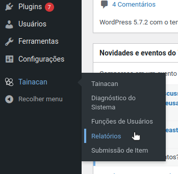
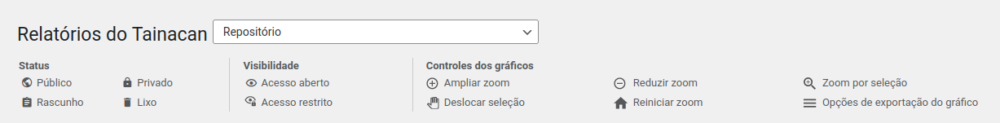
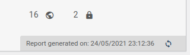
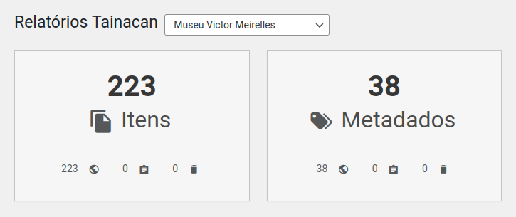
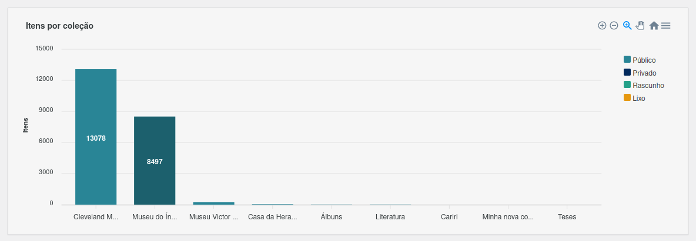
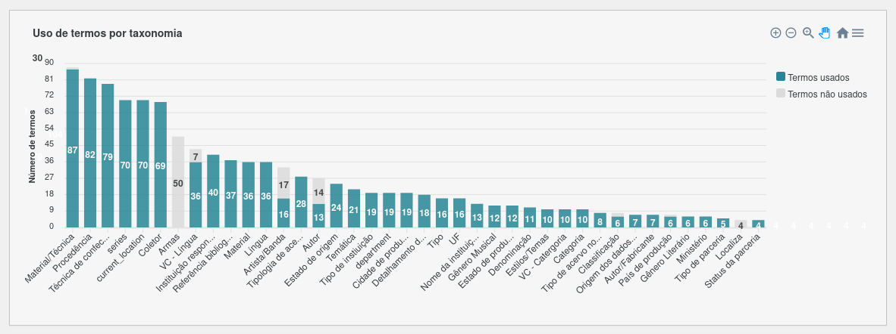
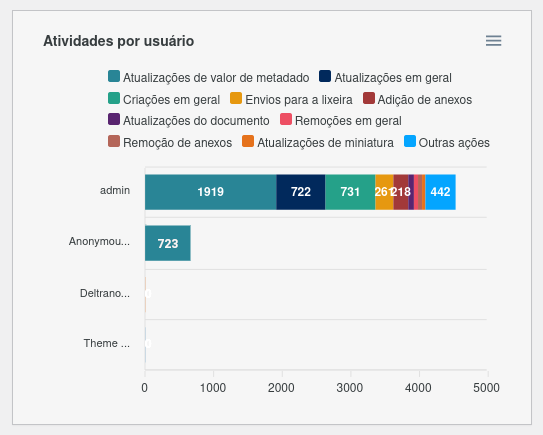
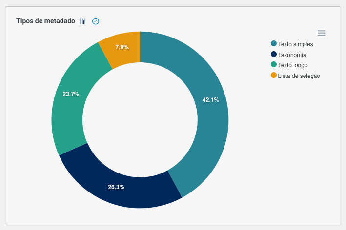
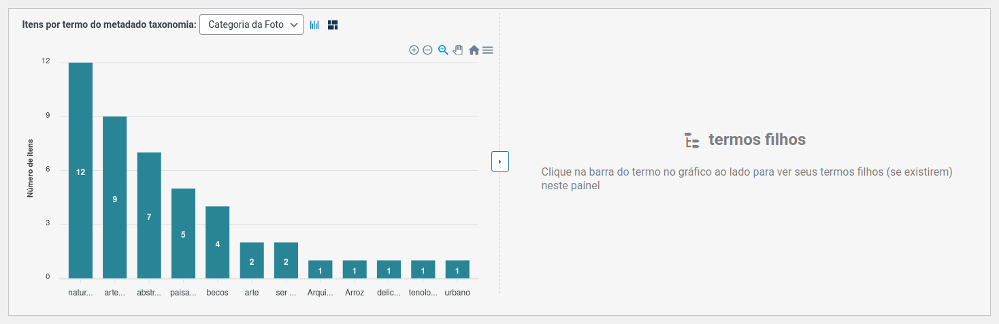
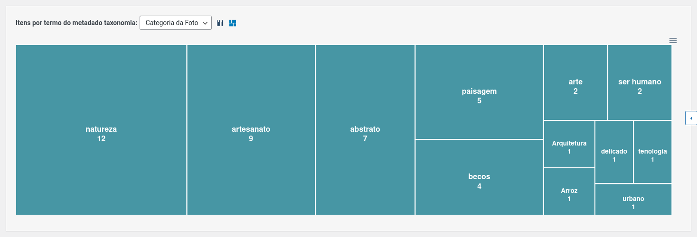

# Reports

Introduced in _version 0.18_, the **Reports Page** or **Reports Dashboard** is the Tainacan module responsible for presenting repository statistics and data through charts. This tool gives collection managers powerful visualizations to better understand data distribution—both to gain insights into the information presented to the public and to support management tasks by identifying areas that require more effort to improve and mature data quality.

On this page, we explain each element present in this dashboard.

## Reports Screen

The Tainacan reports screen is the space where you can access the visualization dashboard generated by the reports API. It is available in the Tainacan plugin submenu, under the label "Reports."

When you first access the dashboard, the general statistics of the Repository are loaded, and a dropdown menu allows you to choose between viewing reports for the entire Repository or for any of the existing collections in the repository.

Just below this dropdown menu, there is a legend bar that helps to understand the iconography used by some blocks on the dashboard:

As already indicated by this legend bar, most charts include an _export_ feature that allows viewing the chart externally in image, vector, or CSV spreadsheet formats, making it easier to incorporate the charts into reports created outside the Tainacan platform.

## Regenerating Reports

To ensure good performance without overloading the server, reports are generated and their information is stored for one week.

?> This means that if you visit this page on a certain day, the data shown in the following 7 days will be the same, even if changes have been made to the repository.

To see the date when the report was generated, simply hover over each block; the information will appear in the lower-left corner, as shown in the adjacent image.

If you want to force an update with the latest data, click the reload button next to this date.

## Summary Blocks

The dashboard begins with the so-called summary blocks, which instead of charts show total numbers of the collection. At the repository level, totals of Collections, Items, and Taxonomies are listed, stratified by their status. At the collection level, the total number of Items and Metadata for that Collection.

A note to be made is that at the repository level, in addition to statuses, items also display **Visibility** information (Open Access / Restricted Access). This information combines the status of the Collection with that of the Item, since items with a _public status_ will not be available to the public if the Collection is _private_.

## Total Items by Collection

The first chart presented in the report is a vertical stacked bar chart. On the Y-axis, it shows the total number of items, and on the X-axis, each collection in the repository. Sorted by the highest number of items from left to right, it is easy to visualize which collections have the largest quantity of items in the repository. On the right-hand side of the chart, the legend indicating the status of the items in the colored fractions of the bars also serves as a filter: clicking on one of the bars hides the data for that status, showing only the remaining ones.

## Term Usage by Taxonomy

The next chart is also a vertical stacked bar chart. On the Y-axis, it shows the total number of terms, and on the X-axis, each taxonomy in the repository. It displays not only the total number of terms in each taxonomy but also which of these terms are being used in at least one item of the repository, through the legend that filters the stacked sections of "Terms in Use" and "Unused Terms." This already gives an initial notion of which taxonomies have a more relevant vocabulary for the collection, quantitatively speaking.

## Total Items by Taxonomy Term

The third chart displayed on the repository screen is a vertical bar chart where the X-axis again shows the total number of items, but the Y-axis now shows terms from a taxonomy. This provides a view of how much each term from each taxonomy is used, but only one taxonomy can be selected at a time using the dropdown menu above the chart.

!> Because this chart can potentially list a large amount of data (some taxonomies in repositories have more than 300 terms), **this is a paginated chart**. This means that at a time, a maximum of **56 terms** are shown. This number was chosen to allow minimal readability of the data on the horizontal axis and not overload the browser memory that must process this information to render the visualization. Since the API request is ordered, you can be assured that the terms shown on the first page will have more items than the following pages. Still, besides navigating pages, it is possible to change the number of items per page, but this may risk freezing the browser!

This chart provides an important view of how items are distributed according to term usage in a taxonomy. An important note is that here **terms are listed without hierarchical distinction**, meaning parent terms and their child terms are at the same level, if any exist. Later we will present [a chart](#total-items-by-metadata-taxonomy-type-in-the-collection) that deals with these hierarchical details.

## Total Activities by User

At the bottom of the reports screen are charts related to collection activity and management. The first is a horizontal stacked bar chart, where the Y-axis lists system users and the X-axis shows the total number of activities performed by each user. This total can be filtered using the legend that groups different types of activities.

## Daily Activities by Year and Users

This chart also visualizes the number of activities per user, but with activities distributed along the X-axis, which contains the last 365 days. The first chart shows the total sum of activities of all users, and below it are charts for the other users, ordered by those with the highest total this year.

With this visualization, it is easy to observe periods of highest activity in the repository, as well as when and how active users were in collection management.

## Collection Metadata Types

The first chart on the reports dashboard of a collection is a vertical bar chart showing the total count of each metadata type used in the collection. This chart has two modes: it can be viewed as a pie chart if preferred, by clicking the icon next to the chart title.

## Metadata Completion Distribution in the Collection

Right beside it is one of the most relevant charts on the collection reports dashboard.

> With this horizontal bar chart, it is easy to visualize which collection metadata fields have values filled in the items.

The Y-axis lists each existing metadata field while the X-axis shows, as a percentage, the total number of items where a value has been entered. This chart can be interpreted as a set of progress bars, from which you can understand which information still needs to be provided to ensure the collection’s documentation is complete.

Because it is not yet possible (due to limitations of the charting library) to implement zoom options on horizontal bar charts like this one, this chart may generate a vertical scroll if the number of existing metadata fields produces many bars on the Y-axis. For this reason, a minimum height for the bars was set to allow label readability within the available screen space.

## Total Items by Metadata Taxonomy Type in the Collection

Finally, on the collection reports dashboard, there is a chart similar to the ["Total Items by Taxonomy Term"](#total-items-by-taxonomy-term) chart found on the repository dashboard. This chart shows how many items have a specific term as the value of a metadata field of taxonomy type. When there is more than one taxonomy-type metadata field in the collection, it is possible to switch between them using the dropdown next to the chart title. The Y-axis displays the total number of items, and the X-axis shows the terms of that taxonomy. As with the previously mentioned chart, this chart also offers pagination for large numbers of terms.

An important difference from the repository-level chart is that **in this one, it is possible to navigate through the hierarchy of these terms**.

> By default, only totals of items by "root" terms are loaded — that is, terms that are not children of any other term. If any of these terms have children, hovering over it will indicate that, and you can click the bar to load a new chart next to it, showing the total items by the child terms of that term. The same routine can be done by clicking on child terms that also have children. In this case, the chart with the children will occupy the space of the parent chart, and the chart with the grandchild terms will take its space. To view only the first chart with more space (for example, if there are no child terms to load), you can click the right-arrow button located between the two panels, which makes the chart occupy the full available width.

Finally, this block also offers an _alternative_ chart view. **Instead of the bar chart, you can view the data in a tree map (_treemap_)**. In this visualization, the area of each rectangle corresponds to the total number of items for all loaded terms. Each inner rectangle represents the nested data of the total items for that term. This visualization provides a particular perspective on the facets of the collection.

